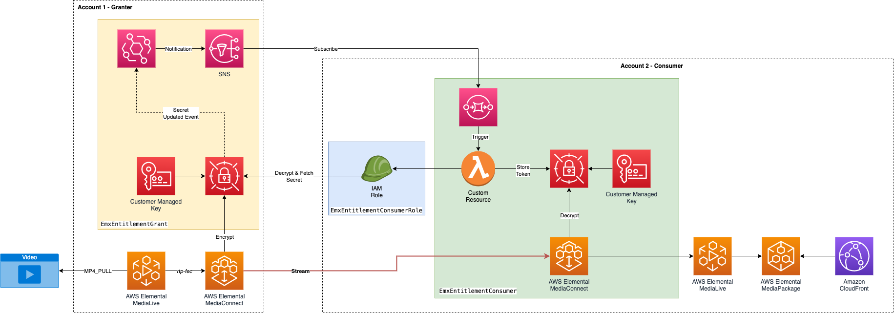

# Infrastructure for granting EMX Entitlements to another account and stop secrets being shared via another medium
## Log
| Date        | Entry   | Version | Comment                             |
|-------------|:-------:|:-------:|-------------------------------------|
| 19/02/2025  | created | 0.0.1   | initial release of the application  | 

## Disclaimer 

The sample code; software libraries; command line tools; proofs of concept; templates; or other related technology is provided to you as AWS Content under the AWS Customer Agreement, or the relevant written agreement between you and AWS (whichever applies). You are responsible for testing, securing, and optimizing the AWS Content, such as sample code, as appropriate for production grade use based on your specific quality control practices and standards. You should not use this AWS Content in your production accounts, or on production or other critical data. Deploying AWS Content may incur AWS charges for creating or using AWS chargeable resources, such as running AWS Elemental Live Channels or using AWS Elemental MediaPackage.

## Table of content
- [Architecture overview](#architecture)
- [Use case](#use_case)
- [Architecture](#architecture)
- [CDK deployment](#cdk)
- [Deployment](#deployment)
- [Known issues](#known_issues)
- [File structure](#files_structure)
- [Tutorial](#tutorial)
- [License](#license)

<a name="architecture"></a>
## Architecture overview

Architecture and proof of concept for being able to automatically provision and share static encryption keys (strings) between 2 AWS accounts. We focus predominantly on two personas: granter and consumer.
Today, when you create 2 AWS Elemental MediaConnect resources with encryption & decryption enabled you have to manually send the secret string from the granter to a consumer via another medium such as email, instant messaging or another method.

This also can be an operational risk when a secret is unintentionally altered/modified in the either account which could result in downtime or an outage - this architecture provides a monitoring mechanism to detect when the string has changed and alert the consuming account to refetch.

__Note__: This is a Proof of Concept architecture and needs in-depth testing.

<a name="existing-experience"></a>
## The Existing Experience

The following steps outline the existing experience for those working with encrypted entitlements and sharing an encrypted key:

1. Granting party generates a secure, random encryption key of the appropriate length (within the requirements of AWS Elemental MediaConnect)
2. Granting party stores the encryption key in Secrets Manager and stores the ARN for later
3. Granting party creates an IAM role that grants permission to read the encryption key from Secrets Manager. The role lists MediaConnect as a trusted entity so that it can assume the role.
4. Granting party updates their AWS Elemental MediaConnect flow to grant the entitlement to a specific account (from the Entitled party). They need to specify the encryption algorithm (AES-128, AES-192, or AES-256) pertaining to the key length they generated. They also need to specify the IAM role that grants Secrets Manager read permissions and the Secrets Manager ARN itself that holds the secret.
5. Granting party shares the encryption key via some method (eg. email) to the party/customer that they intend to entitle.
6. Entitled party stores the encryption key in Secrets Manager in their account.
7. Entitled party creates an IAM role that grants permission to read the encryption key out of Secrets Manager. The role lists MediaConnect as a trusted entity so that it can assume the role.
8. Entitled party creates a flow with an entitled source. They need to specify the encryption algorithm (AES-128, AES-192, or AES-256) pertaining to the key length the were given. They also need to specify the IAM role that grants Secrets Manager read permissions and the Secrets Manager ARN that holds the secret.

<a name="architecture"></a>
## Architecture

### Code Sample Architecture

This proof of concept architectue has leveraged the use of AWS CDK (Cloud Development Kit) to allow the creation of custom abstractions from a granter and consumer perspective.
You could consider building your own privately published construct to stop code duplication and simplify deployment in the future.



#### Key Design Decisions

1. Using resource-based policies instead of identity-based policies as we're sharing resources cross multiple accounts.
2. Architecture uses a custom resource to pull the secret - this can be configured to be run every synth/deploy.
3. To ensure that everything is least-privilage - each grant/consume gets a new secret and KMS Key (Customer Managed Key)
4. The operational part of the architecture needs to use CloudTrail, Events, SNS + SQS to detect and trigger when a key has been changed/updated upstream. It utilizes the same Lambda used in the Custom Resource to retrigger fetch it.
    a. This is **NOT** a way of doing Key Rotation - we only offer Static key encryption.
    b. Testing when changing the key while everything is running, the impact is visible in the stream (shows black screen for multiple seconds)
    c. It also takes a couple of seconds to sync across from the granting account to the consuming account (i.e. to pull the new secret value/encryption key)
5. The Secret created in IaC provides a way of generating the first key - however doesn't update/change it after that. You'd need to architect a way of regenerating the key if desired (in a safe and controlled manor).
6. The initial consumer role needs to be deployed first, so the granter can use that role as the principal for it's own IAM Policies.

##### CloudTrail Dependency
CloudTrail is [required](https://docs.aws.amazon.com/secretsmanager/latest/userguide/monitoring-eventbridge.html) to be enabled to pick up on Secret Manager UpdateSecret events from the Granting Account.

If you don't want to enable CloudTrail or don't want to use this part of the example, you can disable it by setting the option in the Granter CDK App (`disableKeyChangeAutoAlerting`). However, the architecture is automatically deployed with this feature enabled.

### Process / Deployment order

1. The consumer deploys first construct `EmxEntitlementConsumerRole` - this construct only holds a role for the preliminary deploy.
2. Consumer sends this newly created role ARN to Granter to continue the setup.
3. Granter uses the role ARN and consumer's account number to deploy the construct for this new output - Using the `EmxEntitlementGrant` construct.
4. Granter sends Entitlement ARN, SNS Topic ARN (for consumer to subscribe to) & Secret ARN (to fetch the secret string to decrypt the stream) to the consumer.
5. Consumer configures these values in their config and deploys the second construct named `EmxEntitlementConsumer`.
6. The infrastructure is now setup!

<a name="cdk"></a>
## CDK deployment
Visit our [AWS cloud Development Kit](https://aws.amazon.com/cdk/) for more information on CDK.
Get hands-on with CDK running the [CDK introduction workshop](https://cdkworkshop.com/30-python.html).
For this project we will make use of [Typescript version of CDK](https://docs.aws.amazon.com/cdk/v2/guide/work-with-cdk-typescript.html). 
We will create a Typescript app using CDK, this app will abstract all the CloudFormation stack and resource creation.
More information on [CDK best practice](https://docs.aws.amazon.com/cdk/latest/guide/best-practices.html#best-practices-apps) can be found on AWS website.
### Requirements
* [Create an AWS account](_https__:__//portal.aws.amazon.com/gp/aws/developer/registration/index.html_) if you do not already have one and log in. The IAM user that you use must have sufficient permissions to make necessary AWS service calls and manage AWS resources.
* [AWS CLI](_https__:__//docs.aws.amazon.com/cli/latest/userguide/install-cliv2.html_) installed and configured
* [Git Installed](_https__:__//git-scm.com/book/en/v2/Getting-Started-Installing-Git_)
* [AWS Cloud Development Kit](_https__:__//docs.aws.amazon.com/cdk/v2/guide/getting_started.html_) (AWS CDK >= 2.2.0) Installed
* Language used: *Typescript*
* Framework: *AWS CDK*

### Deployment Instructions

1. Create a new directory, navigate to that directory in a terminal and clone the GitHub repository:
```bash
git clone https://github.com/aws-samples/aws-cdk-mediaservices-refarch
```

2. Change directory to the pattern directory:
```bash
cd EMX_SECRET_SHARING
```

3. This project is split between two sub-projects - you need to enter both to both install and deploy (seperately).

**Part 1 deployment**: Consumer Role

1. Move to entitlement consumer directory
```bash
cd emx-entitlement-consumer
```

2. Ensure you have credentials to deploy into the correct account (your nominated consumer account for the video stream).

3. Install the CDK App
```bash
npm install
```

4. Deploy the CDK App

In the first part of deployment - you need to create a role ready for the "granter" to use it.
This step is crucial for implementing resource-based policies in the granting account while maintaining least privilege access, restricting permissions to only the necessary role.

The only construct you want to deploy first is `EmxEntitlementConsumerRole`. This gives you a Role ARN to send to the granting account.
We control this staged deployment with a context variable that tell the CDK App to just deploy the role.

```bash
npm run cdk deploy -- -c stage=role
```

5. Make a note of the Role ARN created - you will need this in deployment part 2. This is part of the stack outputs found the the Console under the CloudFormation service.

6. Upload MP4 file to the granting account to use as a video source. Once you've uploaded the MP4 file, make a note of the S3 URL. This will be used in part 6. This can be in an existing bucket, or a new bucket in the region you are deploying this sample in.

**Part 2 deployment**: AWS Elemental MediaConnect Entitlement - Granting a consuming account

Tip: We recommend you open another terminal window to keep the 2 deployments and credentials seperate.

1. Move to entitlement grant directory
```bash
cd emx-entitlement-grant
```

2. Install the CDK App
```bash
npm install
```

3. Once you have been provided the role ARN from the consuming account - then you can setup the `EmxEntitlementGrant` construct (this is located in [`index.ts`](./emx-entitlement-grant/lib/index.ts?ref_type=heads#L41)).
This construct requires the Stream Identifier, Account ID and Role ARN of the consuming account. 

Ensure you have credentials to deploy into the correct account. These will be credentials to a **different account in part 1**.

4. Deploy the CDK App
```bash
npm run cdk deploy
```

**Part 3 deployment**: Consumer Architecture

1. Navigate back to your first terminal session for the first AWS account deployment (the consumer) where previously you only deployed an IAM Role.

2. If you need to navigate back to the consumer project, use the following:
```bash
cd emx-entitlement-consumer
```

3. If you want to double check you are using the correct account and credentials, use the following command:
```bash
aws sts get-caller-identity
```

4. Once you have received the information you need from the granting account (i.e. the Entitlement ARN), you can deploy the rest of the infrastructure (from Part 2 deployment).
Configure the consumer CDK app - You will need to update the variables in [`granted-config.ts`](./emx-entitlement-consumer/lib/constants/granted-config.ts) with ARN's from the granter account.

5. As per above, ensure you have the credentials configured for the **same account as in part 1** of the deployment.

6. Deployment the CDK App. There is no need for additional context variables this time.
```bash
npm run cdk deploy
```

This stack creates an AWS Elemental MediaLive Channel from the Entitled MediaConnect feed and will also create an Elemental MediaPackage and Amazon CloudFront distribution so you can playback the stream from the upstream account to verify you are recieving video.
If you want to test and experiment with updating the secret in the granting account then keep the video feed running so you can see the impact downstream.

7. After deployment - you need to update the `whitelistCidr` in the `CfnFlow` of the `EmxEntitlementGrantStack` (in the grant CDK App project). This is located in [the main `bin/index.ts` file](./emx-entitlement-grant/lib/index.ts?ref_type=heads#L23). This will allow you to lockdown the `CfnFlow` input to just the Elemental MediaLive instance created in the project.

## Running the architecture

Once your system is deployed and configured correctly, you'll need to start the following:
- MediaConnect Flow in granting account (from part 2)
- MediaLive in the granting account (from part 2)
- MediaConnect Flow in consuming account (from part 3)
- MediaLive Channel in the consuming account (from part 3)

## Testing the architecture

For help on how to test the architecture refer the the [test readme in the project](./TEST.md).

<a name="tutorial"></a>
## Tutorial
See [this useful workshop](https://cdkworkshop.com/20-typescript.html) on working with the AWS CDK for typescript projects.
More about AWS CDK v2 reference documentation [here](https://docs.aws.amazon.com/cdk/api/v2/).
### Useful commands

 * `npm run build`   compile typescript to js
 * `npm run watch`   watch for changes and compile
 * `npm run test`    perform the jest unit tests
 * `cdk ls`          list all stacks in the app
 * `cdk synth`       emits the synthesized CloudFormation template
 * `cdk deploy`      deploy this stack to your default AWS account/region
 * `cdk diff`        compare deployed stack with current state
 * `cdk docs`        open CDK documentation
 * `cdk deploy`      deploy this stack to your default AWS account/region
 * `cdk diff`        compare deployed stack with current state
 * `cdk synth`       emits the synthesized CloudFormation template

### Best practice
* **Security**:
Content security is key to the success of a streaming platform. So make sure to make use of encryption at rest for your assets with the bucket encryption capabilities and secure the transport of your content with https or s3ssl protocols. Ensure you have authentication and authorization in place at a level commensurate with the sensitivity and regulatory requirements of your assets. Consider using MFA whenever possible to access your resources. Where possible access logging should also be enabled and encrypted.
* **Reliability**: 
For demos and debugging purpose this architecture run a single pipeline to process your content. 
However, in a production environment make sure to remove any single point of failure by using the STANDARD mode  which allows for dual pipeline creation to process your content in the cloud. 
* **Operation**: 
Enabling logs on the channel will give you more insight on what is happening in your infrastructure should you need to investigate any issue.
You can enhance your CDK application with API calls to automate operational tasks based on triggers. 
* **Cost**: 
Review your encoding settings to optimize your ABR ladder.
Consider reservation for 24/7 workflow.
Make use of bandwidth optimized control rate such as QVBR to save bandwidth on CDN usage when possible.

<a name="license"></a>
## License
This library is licensed under the MIT-0 License. See the LICENSE file.

