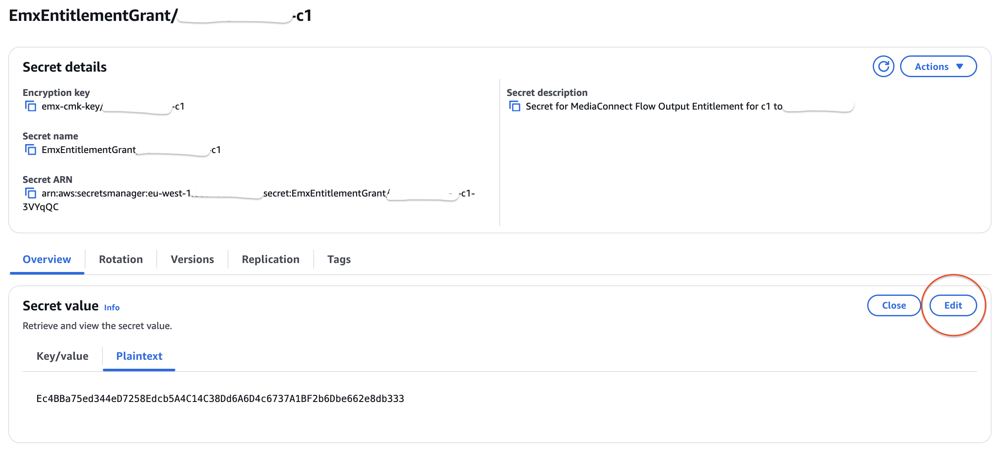
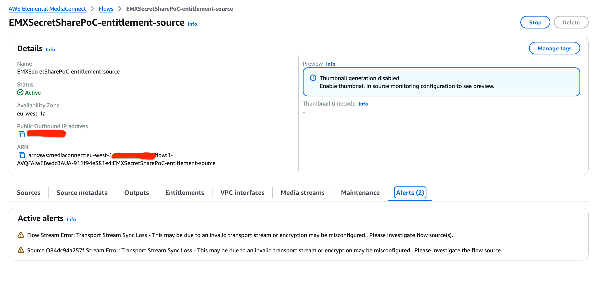
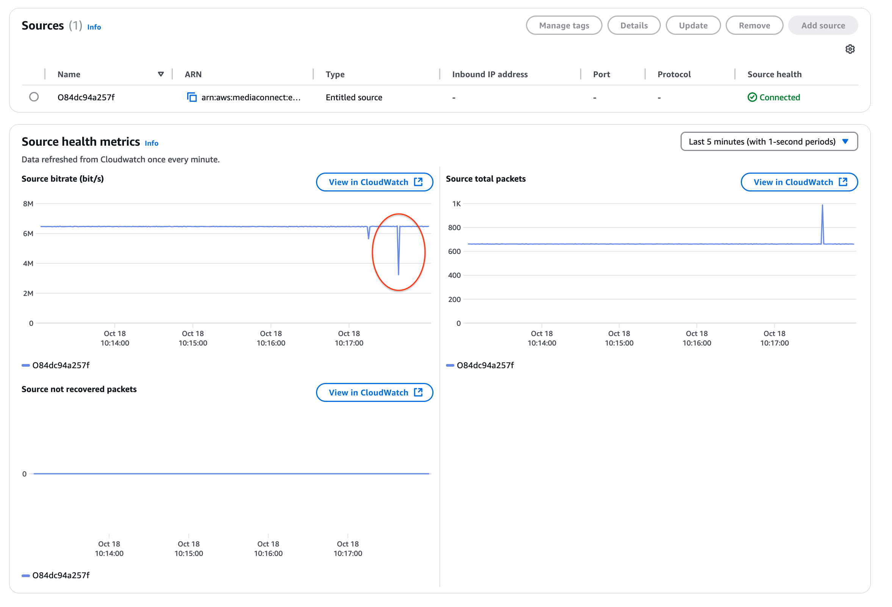

# Testing the code

## Overview

In this section we will guide you through how to test this architecture and trigger a fetch of the secret from granting account.

## Opening the live stream

Ensure both Elemental MediaLive and Elemental MediaConnect is running in each accounts.
Navigate to "outputs" on the CloudFormation stack in the consuming account where you can fetch the manifest URL to open in a player (such as HLS.js) to view the stream.

## Automatic detection and remediation

In the granting account, you can find the secret within Secrets Manager, named similar to `EmxEntitlementGrant/<account-id>-<stream-id>`.
Like mentioned in the main [README.md](./README.md), this is not a key rotation solution - but you can test for when a secret is altered by mistake.

In the console press the "Edit" button and change a couple of the characters in the Secret value field. It is important to keep the same length due to the encryption string length.

Simultaneously, watch the stream you previously loaded in to your test player - after a period of time you'll see the the stream go to black frames with no audio - this is because AWS Elemental MediaConnect can no longer decrypt the stream.

If you are in the console, navigate to Elemental MediaConnect in the consuming account - you will be able to see alerts under the MediaConnect Flow created via this deployment.

You can also see something happened in the stream within the "Source health metrics".

