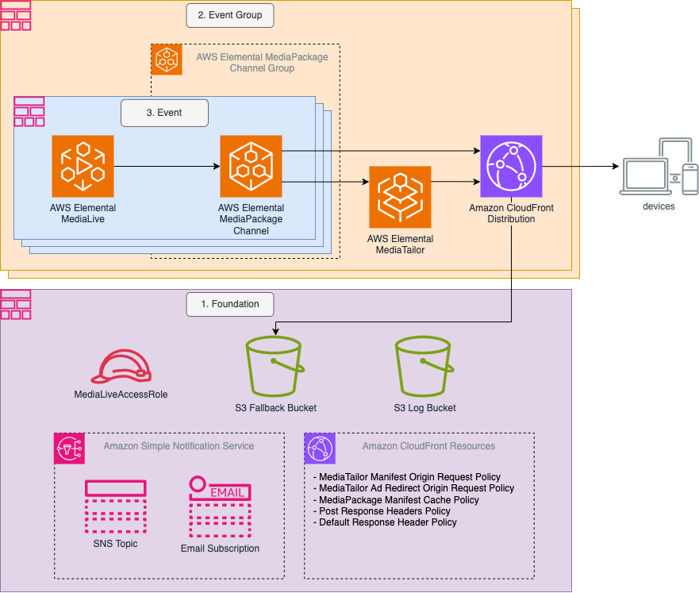

# Live Event Framework

The project is for users aiming to quickly deploy an end-to-end AWS Elemental MediaLive workflow (with or without Server Side Ad Insertion) to evaluate the capabilities delivered by AWS without performing a custom integration. It is intended to enable you to deploy a complete live streaming workflow with MediaLive, MediaPackage V2, and MediaTailor in minutes.

### Prerequisites

- AWS CLI v2 installed and configured
- AWS CDK v2 installed and [bootstrapped](https://docs.aws.amazon.com/cdk/v2/guide/bootstrapping.html)
- Node.js and npm

### Quick Start

You can deploy everything in a single command

1. Clone and setup:

   ```bash
   git clone https://github.com/aws-samples/aws-cdk-mediaservices-refarch
   cd aws-cdk-mediaservices-refarch/LEF
   npm install
   ```

2. Deploy all stacks:

   ```bash
   cdk deploy --all \
     --context userEmail=YOUR_EMAIL \
     --outputs-file ./cdk-exports-all.json
   ```

3. **Important**: Check your email and confirm the SNS subscription for notifications.

4. Start your channel and test:
   ```bash
   ./tools/start_channel.sh
   ./tools/generate_uris.sh
   ```

**That's it!** You now have a complete live streaming workflow ready for testing.

> **Need more control?** See [Deployment Guide](docs/deployment-guide.md) for step-by-step deployment options.

## What You Get

This framework deploys an end-to-end live streaming solution with:

- **MediaLive Channel**: Live encoding with adaptive bitrate ladder
- **MediaPackage V2**: Live origination with HLS/CMAF and DASH/CMAF endpoints
- **MediaTailor**: Server-side ad insertion capabilities
- **CloudFront**: Global content delivery with caching
- **Monitoring**: CloudWatch metrics and optional logging



## Architecture Overview

The framework uses a **3-stack architecture**:

1. **Foundation Stack**: Shared resources (IAM roles, S3 buckets, policies)
2. **Event Group Stack**: Channel group resources (MediaPackage, CloudFront, MediaTailor configs)
3. **Event Stack**: Individual channel resources (MediaLive channel, MediaPackage channel)

This design enables:

- **Scalability**: Deploy multiple channels efficiently
- **Cost Optimization**: Share resources across channels
- **Flexibility**: Different configurations per event group

> **Learn more**: [Architecture Details](docs/architecture.md)

## Deployment Options

| Option                     | Best For                   | Command                                          |
| -------------------------- | -------------------------- | ------------------------------------------------ |
| **Option A: Deploy All**   | Quick evaluation, demos    | `cdk deploy --all`                               |
| **Option B: Step-by-Step** | Production, custom configs | See [Deployment Guide](docs/deployment-guide.md) |

## Testing Your Deployment

1. **Start the channel**: `./tools/start_channel.sh`
2. **Get playback URLs**: `./tools/generate_uris.sh`
3. **Test streaming**: Use the generated URLs in video players

The `generate_uris.sh` script provides:

- Direct MediaPackage URLs (no ads)
- MediaTailor URLs (with ad insertion)
- Test player links for easy validation

> **Detailed testing**: [Testing Guide](docs/testing-and-tools.md)

## Next Steps

### Configuration Options

- [Advanced Configuration](docs/configuration.md) - MediaTailor logging, MediaPackage access logs, custom profiles
- [MediaTailor Guide](docs/mediatailor-guide.md) - Session initialization, ad insertion modes
- [Secure Media Delivery](docs/configuration.md#secure-media-delivery) - Content protection setup

### Scaling and Production

- [Multiple Events](docs/deployment-guide.md#multiple-events) - Deploy additional channels
- [Service Limits](docs/architecture.md#service-limits) - AWS quota considerations
- [Cost Optimization](docs/architecture.md#cost-considerations) - Billing tags and optimization

### Tools and Utilities

- [Encoding Profile Generator](tools/encoding-profile-generator/README.md) - Custom bitrate ladders
- [MediaLive Scheduled Actions](tools/medialive-scheduled-actions/README.md) - Channel automation
- [Custom Transcode Profiles](tools/custom-transcode-profiles/README.md) - Ad transcoding optimization

## Important Notes

⚠️ **This project is not intended for production accounts or production workloads.**

- Designed for evaluation and testing of AWS MediaServices capabilities
- Uses opinionated configurations that may not align with all architectural preferences
- Review [Known Issues](docs/troubleshooting.md#known-issues) before deployment

## Cleanup

Stop your channel and delete stacks in reverse order:

```bash
./tools/stop_channel.sh
cdk destroy LefEventStack --context eventStackName=LefGroup1Event1 --context eventGroupStackName=LefGroup1
cdk destroy LefEventGroupStack --context eventGroupStackName=LefGroup1 --context foundationStackName=LefFoundation1
cdk destroy LefFoundationStack --context foundationStackName=LefFoundation1
```

> **Detailed cleanup**: [Troubleshooting Guide](docs/troubleshooting.md#cleanup)

## Support & Resources

- **Issues**: [Known Issues & Solutions](docs/troubleshooting.md)
- **Configuration**: [Advanced Configuration Options](docs/configuration.md)
- **Architecture**: [Detailed Architecture Guide](docs/architecture.md)
- **AWS CDK**: [CDK Workshop](https://cdkworkshop.com/20-typescript.html)

## Recommendations

Before getting started:

1. Verify [MediaTailorLogger IAM role](tools/mediatailor-logger-role/README.md) exists
2. Consider enabling [Secure Media Delivery at the Edge](https://aws.amazon.com/solutions/implementations/secure-media-delivery-at-the-edge/)
3. Review [service limits](docs/architecture.md#service-limits) for your use case

## License

This library is licensed under the MIT-0 License. See the LICENSE file.
