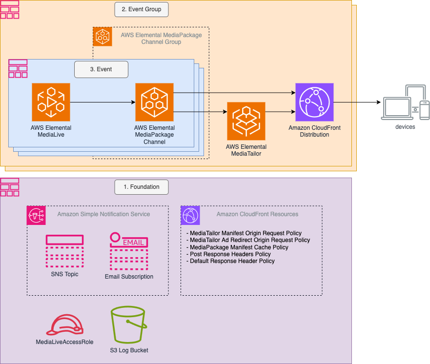

# Live Event Framework

## Log

| Date       |      Entry      | Version | Comment                            |
| ---------- | :-------------: | :-----: | ---------------------------------- |
| 04/02/2025 | Update |  1.0.2  | Update |
| 13/10/2024 | initial release |  0.0.2  | initial release of the application |
| 29/02/2024 |     created     |  0.0.1  |                                    |

## Disclaimer

The sample code; software libraries; command line tools; proofs of concept; templates; or other related technology is provided to you as AWS Content under the AWS Customer Agreement, or the relevant written agreement between you and AWS (whichever applies). You are responsible for testing, securing, and optimizing the AWS Content, such as sample code, as appropriate for production grade use based on your specific quality control practices and standards. 

**You should not use this AWS Content in your production accounts, or on production or other critical data.**

Deploying AWS Content may incur AWS charges for creating or using AWS chargeable resources, such as running AWS Elemental Live Channels or using AWS Elemental MediaPackage.

## Prerequisites

<a name="prerequisites"></a>
Before you start with this project make sure you are familiar with the following tools:

- AWS CLI v2
- AWS CDK v2 Installed and [bootstrapped](https://docs.aws.amazon.com/cdk/v2/guide/bootstrapping.html)
- AWS SDK for Python

## Table of content

- [Project overview](#projectoverview)
- [Recommendations - Before Getting Started](#recommendations)
- [Architecture](#architecture)
- [CDK deployment](#cdk)
- [Deployment Instructions](#deployment)
- [Advanced Configuration Options](#advancedconfigurationoptions)
- [MediaTailor Session Initialization](#mediatailorsessioninitialization)
- [Known issues](#known_issues)
- [Tutorial](#tutorial)
- [License](#license)

<a name="projectoverview"></a>

## Project Overview

**This project is not intended to be deployed in production accounts for production workloads.**

This pattern provides a framework for the deployment of multiple end to end live workflows both with and without server side ad insertion. This framework is intended to:

- simplify the deployment of multiple end to end live workflows in a single account
- simplify the deployment of a MediaTailor Server Side Ad Insertion Workflow
- configure reasonable default settings and provide an example of a well configured workflow

The project is for users aiming to quickly deploy an end-to-end AWS Elemental MediaLive workflow (with or without Server Side Ad Insertion) to evaluate the capabilities delivered by AWS without performing a custom integration. While many configuration options are provided for Event Groups and Events this is intended to be an opinionated implementation and may not align with some users architectural preferences. In the context of this project an **event** refers to a workflow requiring content to be streamed continuously (i.e. a 24x7 live channel) or for a specific duration (e.g. a football match).

This README does not go into the details of every architectural decision made in the implementation of the project. Where necessary comments have been included in the code to provide some insight into the thought process behind the decisions being made.

Over time this project may be updated and/or refactored to reflect the best practises and feature set of the day. The project will not necessarily be updated to maintain backward compatibility with previous configurations or features.

Where AWS Services offered configuration options capable of being enabled concurrently, and these configuration options improve the customer experience they have been enabled. For example, the sample encoding profiles and event group configurations enable both I-frame only and Image-based [trick-play](https://docs.aws.amazon.com/mediapackage/latest/userguide/trick-play.html) rather than making a decision to use only one option.

More details of the key opinionated architecture decisions made in the implementation of this project can be found in the Architecture section below.



**Figure 1. Live Event Framework Architecture Diagram**

<a name="recommendations"></a>

## Recommendations - Before Getting Started

1. Verify MediaTailorLogger IAM role has been created in AWS account. For instructions verifying the role see the [MediaTailorLogger README.md](tools/mediatailor-logger-role/README.md).
2. Please note the [known issues](#known_issues) at the bottom of this document.
3. Enabling the [Secure Media Delivery at the Edge](https://aws.amazon.com/solutions/implementations/secure-media-delivery-at-the-edge/) solution is highly recommended. This solution offers a compelling feature set at a very reasonable cost.
4. Enabling [Content encryption and DRM](https://docs.aws.amazon.com/mediapackage/latest/userguide/using-encryption.html) should be considered (in addition to Secure Media Delivery at the Edge) to further secure premium content.

<a name="architecture"></a>

## Architecture

The Live Event Framework defines 3 separate stacks to deploy different collections of resources. At a high level the stacks are:

1. **Foundation Stack:** Deploys resources used by all channels in a region. Usually this stack would only need to be deployed once per region. Examples of the resources deployed by the foundation stack include IAM Role / Policies required by MediaLive, CloudFront policies and an S3 bucket for logging.
2. **Event Group Stack:** Deploys resources to be used by a subset of channels confined to a MediaPackage Channel Group. The main resources deployed in this stack includes a MediaPackage Channel Group, CloudFront Distribution and MediaTailor Configuration. The event group is dependent on resources deployed in a foundation stack.
3. **Event Stack:** Deploys resources to be used for a single channel (or event). The primary resources deployed in this stack include a MediaLive Channel and MediaPackage Channel. The event stack is dependent on resources created in both the foundation and event group stacks.

Figure 1 above shows the architecture of the Live Event Framework and how the stacks are related. In this diagram:

- A single foundation stack has been deployed
- Two event group stacks have been deployed
- Three event stacks have been deployed in the first event group stack

In some workflows it may be possible to deploy a single Event Group and use this for all Events. If there are more than a couple of channels this will likely require some of the Service Limits to be increased.

All the events deployed in an event group will share the same CloudFront Distribution and MediaTailor configuration. Where event configurations differ significantly consideration should be given to running the events in different event groups.

For example, the CloudFront Distribution includes a number of timeouts based on the nominal segment duration of the content being delivered to the end users. So if there is an existing event group configured for a nominal segment duration of 4 seconds and a new event is being created requiring a 6 second segment length this should be placed into a new appropriately configured event group. Similarly, if a new event required a different MediaTailor configuration this would be a reason to use a different event group.

⚠️ **IMPORTANT NOTE:** **When an event is deployed both MediaTailor and MediaPackage endpoints are created to stream the content. If server side ad insertion is NOT required the MediaPackage endpoint should be used (when server side ad insertion is not required this is the most cost effective option). If the MediaTailor endpoint is used to stream content with no server side ad insertion requirement unnecessary charges for ad delivery (which is charged at the same rate as data transfer out to internet) will be incurred for the delivery of personalized manifests from MediaTailor to the CDN.**

<a name="architecturedecisionsandassumptions"></a>

### Architecture Decisions and Assumptions

1. All interactions between the player and the workflow go through a CloudFront Distribution. This includes session initialization, manifest, media segments, ad segments and tracking requests. Directing all requests through a CloudFront Distribution allows:

   - a single response header policy to be used to enforce a consistent CORS policy on all responses
   - (recommended) [Secure Media Delivery at the Edge](https://aws.amazon.com/solutions/implementations/secure-media-delivery-at-the-edge/) solution to enforce additional restrictions on content playback
   - (optional) [AWS WAF](https://aws.amazon.com/waf/) to provide additional access control and security

2. As all content is delivered from a single CloudFront Distribution many of the URLs returned to the players will be relative URLs. Relative URLs are URLs including the '..' notation. In the past, some players may have had issues with relative URLs but this has not been a problem for some time.

3. [CloudFront Origin Shield](https://docs.aws.amazon.com/AmazonCloudFront/latest/DeveloperGuide/origin-shield.html) has not been enabled on Event Groups by default. CloudFront Origin Shield is an additional layer in the CloudFront caching infrastructure helping to minimize your origin’s load, improve its availability, and reduce its operating costs. These are all great capabilities and we highly recommend enabling CloudFront Origin Shield when operating at scale. However, as [additional charges](https://aws.amazon.com/cloudfront/pricing/) are incurred when using CloudFront Origin Shield this feature has been disabled by default.

4. CloudFront Distributions deployed with the default Event Group configuration have [standard access logs](https://docs.aws.amazon.com/AmazonCloudFront/latest/DeveloperGuide/AccessLogs.html) enabled by default. While it is recommended to enable standard logs these can be disabled to reduce cost.

5. To ensure all requests for manifests are directed to the CloudFront Distribution the [DASH location feature](https://docs.aws.amazon.com/mediatailor/latest/ug/dash-location-feature.html) on the MediaTailor Playback Configuration has been disabled. This feature was disabled to simplify the process of enabling the Secure Media Delivery at the Edge solution on the CloudFront Distribution deployed in this implementation. If Secure Media Delivery at the Edge solution is not being used this feature could be enabled.

6. To minimize the client side integration the implementation uses [server-side reporting](https://docs.aws.amazon.com/mediatailor/latest/ug/ad-reporting-server-side.html) so the MediaTailor service can report ad consumption directly to the ad tracking URL when media segments are requested. There should be nothing in the implementation preventing the use of [client-side reporting](https://docs.aws.amazon.com/mediatailor/latest/ug/ad-reporting-client-side.html) but this does require additional implementation on the clients.

7. While [MediaPackage V2](https://docs.aws.amazon.com/mediapackage/latest/userguide/supported-inputs-live.html#suported-inputs-codecs-live) supports HLS/TS, HLS/CMAF and DASH/CMAF endpoints this implementation only supports HLS/CMAF and DASH/CMAF. There is no technical barrier to implementing HLS/TS as well but it would add complexity to the architecture for little benefit. Considerations in making this decision included:

   - HLS/TS is largely a legacy format and most players today will support HLS/CMAF as well
   - The TS container is less efficient than the CMAF container increasing the cost of delivering HLS/TS relative to HLS/CMAF
   - HLS/CMAF and DASH/CMAF streams can use segments from the same endpoint provided the encryption types are the same. This reduces the MediaPackage Live Origination (reducing cost) and improves CDN cache hit ratios (improving customer experience)

8. MediaTailor provides two options for [session initialization](https://docs.aws.amazon.com/mediatailor/latest/ug/ad-id-session-state.html). This implementation recommends the use of explicit session initialization rather than implicit session initialization because:

   - using explicit session initialization a backend API can initialize the session for a client without the need for ad targeting parameters to be passed to the client. Using this approach prevents the potentially sensitive targeting information from being exposed to viewers.
   - using implicit session initialization the CloudFront Distribution policies would need to be modified each time a new targeting parameter was added or the CloudFront origin request policy would need to be quite permissive (potentially compromising security).

   The implementation does allow sessions to be established using implicit session initialization but this is primarily to make it easier for customers to play demonstration streams.

### Service Limits

AWS has service limits to protect you from unexpected excessive provisioning, malicious actions intended to increase your bill, as well as to protect the service endpoints.
Service limits on the AWS account should be reviewed in the AWS region where the framework will deploy resources. Limit increases can be requested in [Service Quotas](https://console.aws.amazon.com/servicequotas/home) in the AWS Console.
Some specific limits to pay particular attention to include:

- MediaPackage V2
  - Channel Groups
  - Channels per channel group
- MediaLive
  - Channels
  - Push Inputs
  - Input Security Groups (if applicable)
  - HEVC Channels (if applicable)
  - UHD Channels (if applicable)
- CloudFront
  - Query strings per origin request policy

<a name="cdk"></a>

## CDK Deployment

Visit our [AWS cloud Development Kit](https://aws.amazon.com/cdk/) for more information on CDK.
Get hands-on with CDK running the [CDK introduction workshop](https://cdkworkshop.com/20-typescript.html).
For this project we will make use of [Typescript version of CDK](https://docs.aws.amazon.com/cdk/v2/guide/work-with-cdk-typescript.html).
We will create a Typescript app using CDK, this app will abstract all the CloudFormation stack and resource creation.
More information on [CDK best practice](https://docs.aws.amazon.com/cdk/latest/guide/best-practices.html#best-practices-apps) can be found on AWS website.

### Requirements

- [Create an AWS account](_https__:__//portal.aws.amazon.com/gp/aws/developer/registration/index.html_) if you do not already have one and log in. The IAM user that you use must have sufficient permissions to make necessary AWS service calls and manage AWS resources.
- [AWS CLI](_https__:__//docs.aws.amazon.com/cli/latest/userguide/install-cliv2.html_) installed and configured
- [Git Installed](_https__:__//git-scm.com/book/en/v2/Getting-Started-Installing-Git_)
- [AWS Cloud Development Kit](_https__:__//docs.aws.amazon.com/cdk/v2/guide/getting_started.html_) (AWS CDK >= 2.2.0) Installed
- Language used: _Typescript_
- Framework: _AWS CDK_

<a name="deployment"></a>

## Deployment Instructions

1. Create a new directory, navigate to that directory in a terminal and clone the GitHub repository:

   ```bash
   git clone https://github.com/aws-samples/aws-cdk-mediaservices-refarch
   ```

2. Change to the repository directory:

   ```bash
   cd aws-cdk-mediaservices-refarch/LEF
   ```

3. Install node modules:

   ```bash
   npm install
   ```

4. From the command line, use CDK to deploy the LefFoundationStack stack:

   ```bash
   npx cdk deploy LefFoundationStack --context stackName=LefFoundation1 --parameters userEmail=YOUR_EMAIL --outputs-file ./cdk-exports-foundation.json [--context foundationConfigFile=../../config/default/foundationConfiguration.ts]
   ```

5. When the LefFoundationStack is deployed an SNS Topic and SNS email subscription are created using the userEmail parameter passed into the foundation stack. The created SNS topic is used for notifying the person (or group of people) responsible for deploying the stack of notable events. The creation of the email subscription will send an email with a confirmation link to the userEmail.

   ⚠️ **IMPORTANT NOTE:** **<span style="color:red">Prior to deploying the LefEventGroupStack the email subscription MUST be accepted by clicking on the 'Confirm subscription' link in the email.**

   If the email subscription has not been confirm the deployment of LefEventGroupStack will fail.

6. From the command line, use CDK to deploy the LefEventGroupStack stack. The LefEventGroupStack uses some of the resources deployed in the LefFoundationStack and requires the name of the foundation stack to be passed as a paramater:

   ```bash
   npx cdk deploy LefEventGroupStack --context stackName=LefEventGroup1 --parameters foundationStackName=LefFoundation1 --outputs-file ./cdk-exports-event-group.json [--context eventGroupConfigFile=../../config/default/eventGroupConfiguration.ts]
   ```

   Multiple event groups can be created using the same foundation stack but each event group must have a unique stack name.

7. From the command line, use CDK to deploy the LefEventStack stack. Because the LefEventStack resources need to be associated with an existing event group the name of the event group must be passed as a parameter.

   ```bash
   npx cdk deploy LefEventStack --context stackName=LefEvent1 --parameters eventGroupStackName=LefEventGroup1 --outputs-file ./cdk-exports-event.json [--context eventConfigFile=../../config/default/eventConfiguration.ts]
   ```

   Multiple events can be created in the same event group but each event must have a unique stack name. There is an upper limit on the number of MediaPackage Channels which can be deployed in a MediaPackage Channel Group. An increase in this limit can be requested through _Service Quotas_ service in the _AWS Console_.

### Testing

1. Start the MediaLive Channel

   The deployed MediaLive channel can be started from the AWS MediaLive Console or by running the **_tools/start_channel.sh_** script. The **_tools/start_channel.sh_** script parses the CloudFormation stack output file to retrieve the MediaLive Channel ID before attempting to start the channel.

   ```bash
   ./tools/start_channel.sh
   ```

   Below is an example output from a start_channel.sh execution:

   ```bash
   Starting MediaLive Channel: 1234567
   Channel 1234567 is not started
   ...
   Channel 1234567 is not started
   Channel 1234567 is started
   ```

2. Generating sample Playing URLs

   The **_tools/generate_uris.sh_** script parses the CloudFormation stack output file and will print out the URLs for SSAI and non-SSAI playback.

   The output of **generate_uris.sh** provides a links to the [Server Side Ad Insertion Test Player](https://d195a5eb2n34sr.cloudfront.net) with options for initiating a session using either explicit or implicit session initialization. The Server Side Ad Insertion Test Player is a useful tool for understanding how to initiate sessions in MediaTailor.

   ```bash
   ./tools/generate_uris.sh
   ```

   Below is an example output from a generate_uris.sh execution:

   ```console
   DASH/CMAF Stream
   ========================================
   MediaPackage Playback URL : https://d2kzr1fexample.cloudfront.net/out/v1/LefEventGroup1/LefEvent1/cmaf/dash.mpd
   MediaTailor Session Initialization Demo UI Links:
   - Explicit Session Initialization: https://d195a5eb2n34sr.cloudfront.net?url=https://d2kzr1fexample.cloudfront.net/v1/session/64aeecfad278cEXAMPLEbb569fe792461EXAMPLE/LefEventGroup1/out/v1/LefEventGroup1/LefEvent1/cmaf/dash.mpd&playerparams=[{"key":"content_segment_prefix","value":"dash-cmaf"},{"key":"ad_segment_prefix","value":"dash-cmaf"}]&serverreporting=true
   - Implicit Session Initialization: https://d195a5eb2n34sr.cloudfront.net?url=https://d2kzr1fexample.cloudfront.net/v1/dash/64aeecfad278cEXAMPLEbb569fe792461EXAMPLE/LefEventGroup1/out/v1/LefEventGroup1/LefEvent1/cmaf/dash.mpd&playerparams=[{"key":"content_segment_prefix","value":"dash-cmaf"},{"key":"ad_segment_prefix","value":"dash-cmaf"}]&serverreporting=true

   HLS/CMAF Stream
   ========================================
   MediaPackage Playback URL : https://d2kzr1fexample.cloudfront.net/out/v1/LefEventGroup1/LefEvent1/cmaf/index.m3u8
   MediaTailor Session Initialization Demo UI Links:
   - Explicit Session Initialization: https://d195a5eb2n34sr.cloudfront.net?url=https://d2kzr1fexample.cloudfront.net/v1/session/64aeecfad278cEXAMPLEbb569fe792461EXAMPLE/LefEventGroup1/out/v1/LefEventGroup1/LefEvent1/cmaf/index.m3u8&playerparams=[{"key":"content_segment_prefix","value":"hls-cmaf"},{"key":"ad_segment_prefix","value":"hls-cmaf"}]&serverreporting=true
   - Implicit Session Initialization: https://d195a5eb2n34sr.cloudfront.net?url=https://d2kzr1fexample.cloudfront.net/v1/master/64aeecfad278cEXAMPLEbb569fe792461EXAMPLE/LefEventGroup1/out/v1/LefEventGroup1/LefEvent1/cmaf/index.m3u8&playerparams=[{"key":"content_segment_prefix","value":"hls-cmaf"},{"key":"ad_segment_prefix","value":"hls-cmaf"}]&serverreporting=true
   ```

3. Open the **Server Side Ad Insertion Test Player** link generated above to get a better understanding of the options available when initializing a MediaTailor session and test these options.

### Clean up

1. Stop the MediaLive Channel
   ```bash
   ./tools/stop_channel.sh
   ```
   Below is an example output from a stop_channel.sh execution:
   ```bash
   Stopping MediaLive Channel: 1234567
   Channel 1234567 is not stopped
   ...
   Channel 1234567 is not stopped
   Channel 1234567 is stopped
   ```
2. Destroy the event stack
   ```bash
   npx cdk destroy LefEventStack --context stackName=LefEvent1 --profile $AWS_PROFILE
   ```
3. Destroy the event group stack
   ```bash
   npx cdk destroy LefEventGroupStack --context stackName=LefEventGroup1 --profile $AWS_PROFILE
   ```
4. Destroy the foundation stack
   ```bash
   npx cdk destroy LefFoundationStack --context stackName=LefFoundation1 --profile $AWS_PROFILE
   ```

<a name="known_issues"></a>

## Known Issues

Please make sure the associated channel is in idle state before running the destroy command for an event stack.
You can check your channel status by logging in to your AWS console ==> MediaLive ==> Channel.
Once on the MediaLive Channel dashboard identify your channel and tick the box on the left side of the channel list.<br>
Then click on the button stop and wait for the channel to be in idle state before you proceed with the destroy command.<br>

1. The default eventConfiguration uses a public policy for MediaPackage V2 endpoints making the endpoints publicly available on the internet. Best practise workflows should *NOT* use public endpoint policies. Custom policies restrict which services can make requests to the MediaPackage origin endpoint limiting the risk of a large volume of requests being made to the origin exceeding service limits. The Live Event Framework will be updated to use a custom policy by default when ther MediaTailor feature to sign origin requests is made generally available. For production workflows requiring custom policies now, raise a MediaTailor support ticket requesting MediaTailor signing of origin requests be enabled on the account.
2. The default eventConfiguration sets "includeIframeOnlyStreams: false" on the MediaPackage segments. This value was intended to be set to 'true' but needed to be disabled because this was causing an issue getting MediaTailor Dynamic DASH ad transcoding working. Once this is resolved the default value will be changed back to 'true'.
3. The segmentLengthInSeconds has been set to 4s to avoid an issue with the MediaPackage V2 segment combining logic. Once this issue has been addressed the segment size should be changed back to 2s. Using a 2 value enables more granular segment harvesting.
4. MediaTailor does not support setting the logPercentage using CDK/CloudFormation. Once the **MediaTailorLogger** role has been created the default log percentage of 100% will be applied to MediaTailor Configurations deployed using the Live Event Framework. At scale, the volume of logs and associated charges can become significant. AWS recommend reducing the log percentage to 10% or less. Retaining a small amount of log sampling will enable the health of the service to be observed while reducing charges for CloudWatch logs.

<a name="advancedconfigurationoptions"></a>

## Advanced Configuration Options

### Configuring Workflow to use Secure Media Delivery at the Edge on AWS Solution

The Live Event Framework has been architected to be compatible with the [Secure Media Delivery at the Edge on AWS solution](https://aws.amazon.com/solutions/implementations/secure-media-delivery-at-the-edge/).
Deploying the Secure Media Delivery at the Edge on AWS solution in conjunction with the Live Event Framework is highly recommended to help secure content from unauthorized access. The Secure Media Delivery at the Edge on AWS solution can be used with Digital Rights Management solutions as part of a defence in depth strategy to protect content.
After deploying the Secure Media Delivery at the Edge on AWS solution it can be enabled on specific event groups by setting the **eventGroup.cloudFront.tokenizationFunctionArn** configuration parameter in the eventGroupConfiguration file to the value of the **CheckTokenFunction ARN** deployed by the solution.

Enabling the Secure Media Delivery at the Edge on AWS solution will incur additional costs. For a more detailed breakdown of the potential costs [see this page](https://docs.aws.amazon.com/solutions/latest/secure-media-delivery-at-the-edge-on-aws/cost.html).

### Configuring Workflow to use preferred MediaLive Profile

The default 'config/eventConfiguration.yaml' refers to the 'encoding-profiles/sample-profiles/hd-avc-50fps-sample-medialive-hls-ts-v1.json' as the default MediaLive encoding profile. For an initial test to verify the workflow this will often be sufficient but in many cases users would prefer to define their own adaptive bitrate ladder. The adaptive bitrate ladder can be customize by either:

1. Using the [Encoding Profile Set Generator](tools/encoding-profile-generator/README.md) to simplify the creation of a MediaLive profile.
2. Copying a working profile (such as 'encoding-profiles/sample-profiles/hd-avc-50fps-sample-medialive-hls-ts-v1.json') and making modifications manually and modifying the event configuration yaml to refer to the new encoding configuration.

### Configuring Workflow to use MediaTailor Custom Transcode Profiles

MediaTailor will automatically transcode HLS/TS, HLS/CMAF and DASH ad creative for insertion into live streams. Unfortunately, it is not possible to perfectly match the ad transcode to the live stream without additional information about the live encoder configuration. In some cases minor discrepancies between the ad transcodes and live stream can result in certain playback devices experiencing issues transitioning in and out of ad breaks. In these cases MediaTailor supports custom ad transcode profiles. Custom ad transcode profiles define the parameters used in the ad transcode to more closely align the ad transcode with the live stream.

See the [Custom Transcode Profiles README.md](tools/custom-transcode-profiles/README.md) on enabling and configuring custom transcode profiles in your account.

### Configuring Workflow to use Elemental Live Appliances

The Live Event Framework supports the deployment of AWS resources for workflows using [AWS Elemental Live](https://aws.amazon.com/elemental-live/) Appliances for on-premise encoding.

See the [AWS Elemental Live README.md](tools/elemental-live/README.md) for instructions to setup a workflow using an AWS Elemental Live appliance.

<a name="mediatailorsessioninitialization"></a>

## MediaTailor Session Initialization

MediaTailor provides two options for [session initialization](https://docs.aws.amazon.com/mediatailor/latest/ug/ad-id-session-state.html). The [Architecture Decisions and Assumptions](#architecturedecisionsandassumptions) section outlines why explicit session initialization is the recommended approach.

The Live Event Framework requires a number of mandatory MediaTailor [dynamic variables](https://docs.aws.amazon.com/mediatailor/latest/ug/variables.html). These dynamic variables are:

- _**content_segment_prefix**_ (mandatory): Defines the content delivery network prefix for content segments from the available values in the _player_params.content_segment_prefix_ configuration alias on the MediaTailor Playback configuration.
- _**ad_segment_prefix**_ (mandatory): Defines the content delivery network prefix for ad segments from the available values in the _player_params.ad_segment_prefix_ configuration alias on the MediaTailor Playback configuration.

**Note:** If any of the mandatory dynamic variables are not set the MediaTailor session will not be created and an error message will be returned.

Both _content_segment_prefix_ and _ad_segment_prefix_ vary between HLS and DASH streams because for HLS streams the segments need to be located relative to the variant manifest. For DASH streams the segments are relative to the manifest resulting in a different number of parent directory operators ('..') to get back to the root level of the distribution.

### MediaTailor Explicit Session Initialization Example

To explicitly initialize a MediaTailor session a HTTP POST is sent to the MediaTailor Playback Configuration Session Initialization Prefix (the start of the path will be '/v1/session') with the body of the post containing the session initialization parameters.
The bash commands below show an example of how a MediaTailor session can be explicitly initialized from a bash command line. In a production environment the explicit session initialization is most commonly performed by a backend API. This sequence of commands is intended to help users understand the steps involved in explicitly initializing a session.

```bash
function mediaTailorExplicitSessionInit() {
    sessionUrl=$1
    streamType=$2

    echo -e "\033[1;30mMediaTailor Session URL:\033[0m \033[0;34m$sessionUrl\033[0m"
    echo -e "\033[1;30mMediaTailor Stream Type:\033[0m \033[0;34m$streamType\033[0m"

    # Get CloudFront Hostname
    CLOUDFRONT_HOSTNAME=`echo $sessionUrl | awk -F[/:] '{ print $4 }'`
    echo -e "\033[1;30mCloudFront Distribution Hostname:\033[0m \033[0;34m$CLOUDFRONT_HOSTNAME\033[0m"

    # Curl MediaTailor to get manifest URL
    SESSION_INIT_RESPONSE=$(curl --no-progress-meter -X POST "${sessionUrl}" -d "{ \
    \"reportingMode\": \"SERVER\", \
    \"playerParams\": {
                        \"content_segment_prefix\": \"${streamType}\", \
                        \"ad_segment_prefix\": \"${streamType}\" \
                    } }" 2>&1)

    # Check if curl returned an error
    if [ $? -ne 0 ]; then
        echo -e "\033[1;31mError: curl command failed with error:\033[0m"
        echo "$SESSION_INIT_RESPONSE"
        return 1
    fi

    echo -e "\033[1;30mMediaTailor Session Init Response:\033[0m"
    echo $SESSION_INIT_RESPONSE | jq

    mediaTailorManifestUrl=`echo $SESSION_INIT_RESPONSE | jq -r .manifestUrl`

    # Return playback URL
    echo -e "\033[1;30mPlayback URL:\033[0m \033[0;34mhttps://${CLOUDFRONT_HOSTNAME}${mediaTailorManifestUrl}\033[0m"
    return 0
}

sessionUrl="https://d2kzr1fexample.cloudfront.net/v1/session/64aeecfad278cEXAMPLEbb569fe792461EXAMPLE/LefEventGroup1/out/v1/LefEventGroup1/LefEvent1/cmaf/index.m3u8"
streamType='hls-cmaf'
mediaTailorExplicitSessionInit $sessionUrl $streamType
```

Below is example output from the _mediaTailorExplicitSessionInit_ function for a MediaTailor HLS Session. The Playback URL is the URL the player needs to call to initiate playback. Note how the playback URL has a single query parameter of 'aws.sessionId'.

```bash
MediaTailor Session URL: https://d2kzr1fexample.cloudfront.net/v1/session/64aeecfad278cEXAMPLEbb569fe792461EXAMPLE/LefEventGroup1/out/v1/LefEventGroup1/LefEvent1/cmaf/index.m3u8
MediaTailor Stream Type: hls-cmaf
CloudFront Distribution Hostname: d2kzr1fexample.cloudfront.net
MediaTailor Session Init Response:
{
  "manifestUrl": "/v1/master/64aeecfad278cEXAMPLEbb569fe792461EXAMPLE/LefEventGroup1/out/v1/LefEventGroup1/LefEvent1/cmaf/index.m3u8?aws.sessionId=4f0e823f-2f49-4001-8382-ffa96fa24bb1",
  "trackingUrl": "/v1/tracking/64aeecfad278cEXAMPLEbb569fe792461EXAMPLE/LefEventGroup1/4f0e823f-2f49-4001-8382-ffa96fa24bb1"
}
Playback URL: https://d2kzr1fexample.cloudfront.net/v1/master/64aeecfad278cEXAMPLEbb569fe792461EXAMPLE/LefEventGroup1/out/v1/LefEventGroup1/LefEvent1/cmaf/index.m3u8?aws.sessionId=4f0e823f-2f49-4001-8382-ffa96fa24bb1
```

### MediaTailor Implicit Session Initialization Example

To implicitly initialize a MediaTailor session a HTTP GET is sent to the MediaTailor Playback Configuration HLS or DASH playback Prefix (the start of the path will be '/v1/master' for a HLS stream and '/v1/dash' for a DASH session). This initial HTTP GET must include all the required session initialization parameters as query strings.

#### HLS Implicit Session Initialization Example

For a HLS playback URL when MediaTailor recieves a valid implicit session initialization request the returned multi-variant manifest file includes the 'aws.sessionId' in the path of each of the variant manifests.

The curl command below shows an example of how a MediaTailor session can be implicitly initialized from a bash command line and and example of a returned multi-variant manifest.

```console
curl "https://d2kzr1fexample.cloudfront.net/v1/master/64aeecfad278cEXAMPLEbb569fe792461EXAMPLE/LefEventGroup1/out/v1/LefEventGroup1/LefEvent1/cmaf/index.m3u8?playerParams.content_segment_prefix=hls-cmaf&playerParams.ad_segment_prefix=hls-cmaf"
```

Below is an example of a HLS multi-variant manifest returned by MediaTailor. Note each of the links to the variant manifests includes the '1685679a-7b9b-4fc7-9a60-f0f66e0d4048' session Id in the path.

```
#EXTM3U
#EXT-X-VERSION:6
#EXT-X-INDEPENDENT-SEGMENTS
#EXT-X-MEDIA:LANGUAGE="en",AUTOSELECT=YES,CHANNELS="2",FORCED=NO,TYPE=AUDIO,URI="../../../../../../../../manifest/64aeecfad278cEXAMPLEbb569fe792461EXAMPLE/LefEventGroup1/1685679a-7b9b-4fc7-9a60-f0f66e0d4048/7.m3u8",GROUP-ID="aac",DEFAULT=YES,NAME="English"
#EXT-X-STREAM-INF:CODECS="mp4a.40.2,avc1.64001F",AVERAGE-BANDWIDTH=3440800,RESOLUTION=960x540,VIDEO-RANGE=SDR,FRAME-RATE=50.0,BANDWIDTH=3968798,AUDIO="aac"
../../../../../../../../manifest/64aeecfad278cEXAMPLEbb569fe792461EXAMPLE/LefEventGroup1/1685679a-7b9b-4fc7-9a60-f0f66e0d4048/1.m3u8
#EXT-X-STREAM-INF:CODECS="mp4a.40.2,avc1.64002A",AVERAGE-BANDWIDTH=8390800,RESOLUTION=1920x1080,VIDEO-RANGE=SDR,FRAME-RATE=50.0,BANDWIDTH=9710798,AUDIO="aac"
../../../../../../../../manifest/64aeecfad278cEXAMPLEbb569fe792461EXAMPLE/LefEventGroup1/1685679a-7b9b-4fc7-9a60-f0f66e0d4048/2.m3u8
#EXT-X-STREAM-INF:CODECS="mp4a.40.2,avc1.640020",AVERAGE-BANDWIDTH=5090800,RESOLUTION=1280x720,VIDEO-RANGE=SDR,FRAME-RATE=50.0,BANDWIDTH=5882797,AUDIO="aac"
../../../../../../../../manifest/64aeecfad278cEXAMPLEbb569fe792461EXAMPLE/LefEventGroup1/1685679a-7b9b-4fc7-9a60-f0f66e0d4048/3.m3u8
#EXT-X-STREAM-INF:CODECS="mp4a.40.2,avc1.64001F",AVERAGE-BANDWIDTH=2120800,RESOLUTION=640x360,VIDEO-RANGE=SDR,FRAME-RATE=50.0,BANDWIDTH=2437598,AUDIO="aac"
../../../../../../../../manifest/64aeecfad278cEXAMPLEbb569fe792461EXAMPLE/LefEventGroup1/1685679a-7b9b-4fc7-9a60-f0f66e0d4048/4.m3u8
#EXT-X-STREAM-INF:CODECS="mp4a.40.2,avc1.64001E",AVERAGE-BANDWIDTH=1240800,RESOLUTION=480x270,VIDEO-RANGE=SDR,FRAME-RATE=50.0,BANDWIDTH=1416797,AUDIO="aac"
../../../../../../../../manifest/64aeecfad278cEXAMPLEbb569fe792461EXAMPLE/LefEventGroup1/1685679a-7b9b-4fc7-9a60-f0f66e0d4048/5.m3u8
#EXT-X-STREAM-INF:CODECS="mp4a.40.2,avc1.640015",AVERAGE-BANDWIDTH=800800,RESOLUTION=320x180,VIDEO-RANGE=SDR,FRAME-RATE=50.0,BANDWIDTH=906397,AUDIO="aac"
../../../../../../../../manifest/64aeecfad278cEXAMPLEbb569fe792461EXAMPLE/LefEventGroup1/1685679a-7b9b-4fc7-9a60-f0f66e0d4048/6.m3u8
```

#### DASH Implicit Session Initialization Example

For a DASH playback URL when MediaTailor recieves a valid implicit session initialization request the response is a HTTP 302 redirect to the same playback URL with a 'aws.sessionId' query parameter appended.

The curl command below shows an example of how a MediaTailor session can be implicitly initialized from a bash command line.

```console
curl -v "https://d2kzr1fexample.cloudfront.net/v1/master/64aeecfad278cEXAMPLEbb569fe792461EXAMPLE/LefEventGroup1/out/v1/LefEventGroup1/LefEvent1/cmaf/index.m3u8?playerParams.content_segment_prefix=dash-cmaf&playerParams.ad_segment_prefix=dash-cmaf"
```

Below is an extract of the returned redirect when using the curl command above. Note the 'aws.sessionId' parameter has been appended to the 'location' where the client is redirected.

```console
HTTP/2 302
content-type: application/dash+xml
content-length: 0
x-amzn-errortype: GetDashManifestRedirectException
location: /v1/dash/64aeecfad278cEXAMPLEbb569fe792461EXAMPLE/LefEventGroup1/out/v1/LefEventGroup1/LefEvent1/cmaf/dash.mpd?playerParams.content_segment_prefix=dash-cmaf&playerParams.ad_segment_prefix=dash-cmaf&aws.sessionId=e780a8ea-0757-4a53-bfc3-dfb44524cf3b
x-cache: Miss from cloudfront
```

<a name="tutorial"></a>

## Tutorial

See [this useful workshop](https://cdkworkshop.com/20-typescript.html) on working with the AWS CDK for typescript projects.
More about AWS CDK v2 reference documentation [here](https://docs.aws.amazon.com/cdk/api/v2/).

### Useful commands

- `npm run build` compile typescript to js
- `npm run watch` watch for changes and compile
- `npm run test` perform the jest unit tests
- `cdk ls` list all stacks in the app
- `cdk synth` emits the synthesized CloudFormation template
- `cdk deploy` deploy this stack to your default AWS account/region
- `cdk diff` compare deployed stack with current state
- `cdk docs` open CDK documentation
- `cdk deploy` deploy this stack to your default AWS account/region
- `cdk diff` compare deployed stack with current state
- `cdk synth` emits the synthesized CloudFormation template

### Best practice

- **Security**
  Content security is key to the success of a streaming platform. So make sure to make use of encryption at rest for your assets with the bucket encryption capabilities and secure the transport of your content with https or s3ssl protocols. Ensure you have authentication and authorization in place at a level commensurate with the sensitivity and regulatory requirements of your assets. Consider using MFA whenever possible to access your ressources.
- **Reliability**:
  For demos and debugging purpose this solution can run a single pipeline to process your content.
  However, in a production environment make sure to remove any single point of failure by using the STANDARD mode which allows for dual pipeline creation to process your content in the cloud. Use also a [blue green method](https://docs.aws.amazon.com/whitepapers/latest/overview-deployment-options/bluegreen-deployments.html) for your deployment strategy.
- **Operation**:
  Enabling logs on the channel will give you more insight on what is happening in your infrastructure should you need to investigate any issue.
  You can enhance your CDK application with API calls to automate operational tasks based on triggers.
- **Cost**:
  Review your encoding settings to optimize your ABR ladder.
  Consider reservation for 24/7 workflow.
  Make use of bandwidth optimized control rate such as QVBR to save bandwidth on CDN usage when possible.

<a name="license"></a>

## License

This library is licensed under the MIT-0 License. See the LICENSE file.
