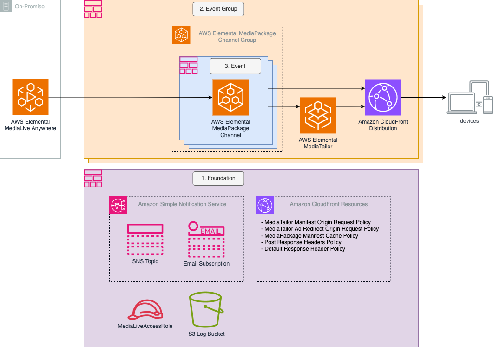

# Configuring Workflow to use MediaLive Anywhere

The [default event configuration](../../config/default/eventConfiguration.ts) creates a workflow using AWS Elemental MediaLive to encode the live stream. The Live Event Framework also supports workflows deploying [AWS Elemental MediaLive Anywhere](https://aws.amazon.com/medialive/features/anywhere/) live video encoding. Figure 1 below shows the Live Event Framework architecture using MediaLive Anywhere rather than MediaLive as the encoder. Using the Live Event Framework it is possible to deploy events using MediaLive, MediaLive Anywhere and Elemental Live encoders into the same channel group.



**Figure 1. Live Event Framework Architecture Diagram using AWS Elemental MediaLive Anywhere**

## Prerequisites

AWS Elemental MediaLive Anywhere channels are deployed into MediaLive Anywhere Clusters. Before MediaLive Anywhere channels can be deployed, a MediaLive Anywhere Cluster (and other associated resources) needs to be setup in the AWS account.

[Setting up AWS Elemental MediaLive Anywhere](https://docs.aws.amazon.com/medialive/latest/ug/setup-emla.html) provides guidance on preparing your AWS account before deploying a MediaLive Anywhere Channel.

## Configuring Event Stack to use MediaLive Anywhere

Configuring a MediaLive Anywhere channel is very similar to the configuration for a MediaLive channel.

MediaLive Anywhere channels support a number of additional input types.

- Multicast
- SDI

  **Note: Multicast and SDI inputs do not make sense for MediaLive to support as these inputs cannot be delivered in the AWS Cloud.**

The [default Event Stack configuration file](../../config/default/eventConfiguration.ts) is configured to deploy a Standard MediaLive Channel. MediaLive Anywhere does not support the deployment of standard channels.

The following changes are require to the default configuration to convert it from a MediaLive, to a MediaLive Anywhere channel.

1. Channel Class
   Set the 'event.mediaLive.channelClass' to 'SINGLE_PIPELINE'.

2. Configure MediaLive Anywhere Cluster
   Set the 'event.mediaLive.anywhereSettings' to an object specifying the 'channelPlacementGroupId' and 'clusterId'.

Below is an example showing how these values might be set in the configuration file.

```typescript
export const EVENT_CONFIG: IEventConfig = {
  event: {
    mediaLive: {
      channelClass: "SINGLE_PIPELINE",
      anywhereSettings: {
        channelPlacementGroupId: '1234567',
        clusterId: '3456789',
      },
```

## Deploying an Event Stack using MediaLive Anywhere

The process for deploying a Live Event Framework Event Stack is the same regardless of the encoder type (see [README](../../README.md#deployment)).
