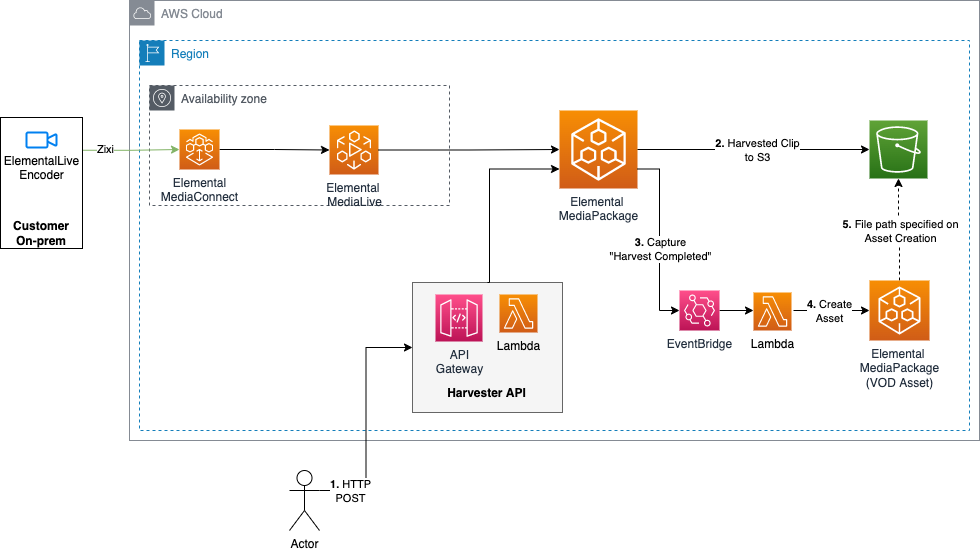
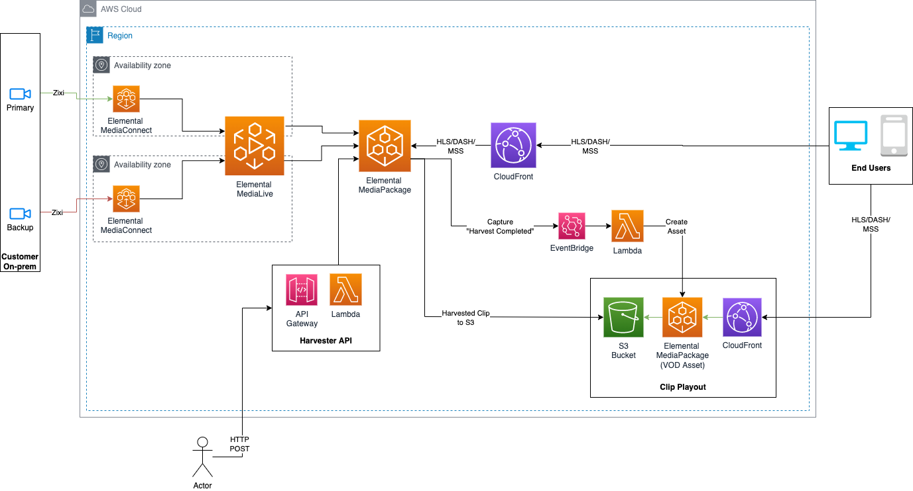

# Live2VOD Workflow
## Log
| Date        | Entry   | Version | Comment                             |
|-------------|:-------:|:-------:|-------------------------------------|
| 07/02/2022  | created | 0.0.1   | initial release of the application  | 

## Disclaimer 

The sample code; software libraries; command line tools; proofs of concept; templates; or other related technology is provided to you as AWS Content under the AWS Customer Agreement, or the relevant written agreement between you and AWS (whichever applies). You are responsible for testing, securing, and optimizing the AWS Content, such as sample code, as appropriate for production grade use based on your specific quality control practices and standards. You should not use this AWS Content in your production accounts, or on production or other critical data. Deploying AWS Content may incur AWS charges for creating or using AWS chargeable resources, such as running AWS Elemental Live Channels or using AWS Elemental MediaPackage.

## Table of content
- [Solution overview](#solution)
- [Use case](#use_case)
- [Architecture](#architecture)
- [CDK deployment](#cdk)
- [Deployment](#deployment)
- [Known issues](#known_issues)
- [File structure](#files_structure)
- [Tutorial](#tutorial)
- [License](#license)

<a name="solution"></a>
## Solution overview
This sample solution provides a practical code example to harvest clips from a MediaPackage Channel to an S3 bucket and ingest them as a MediaPackage VOD asset all through a simple RestApi call.

### Stack Descriptions
| Stack Name | Description |
|---------|-------------|
| MediaServicesRefArch-L2V-vodassets-stack | S3 bucket - used by MediaPackage to store clips that are harvested. |
| MediaServicesRefArch-L2V-media-stack | The live workflow using MediaConnect, MediaLive & MediaPackage. |
| MediaServicesRefArch-L2V-harvestapi-stack | Rest API for a user to "submit" a job to MediaPackage. Information on how to invoke the API can be [seen below](#testing). |
| MediaServicesRefArch-L2V-harvestcomplete-stack | Catches EventBridge event from MediaPackage when a harvesting has occured and uses Lambda to ingest into MediaPackage as a VoD asset. |

<a name="use_case"></a>
## Use case
You may want to use the MediaPackage Harvest API to save clips from a game for a highlight reel, or a broadcast show to use later in adertisements for the show.
For further information have a look at our [documentation](https://docs.aws.amazon.com/mediapackage/latest/ug/ltov.html).

<a name="architecture"></a>
## Architecture

### Code Sample Architecture
For this sample, we have broken it down to be simpler and less resources deployed into your account.



### Full Architecture

In the full architecture diagram below, there are a few improvements to be seen versus the code sample provided:
1. The code sample only uses a single pipeline - for redudency, we recommend using a standard pipeline (across 2 AZ's)
2. There is only 1 output stream going to an origin (for simplicity only) - we recommend building and deploying a full ABR ladder.



<a name="cdk"></a>
## Prerequisite
For your ElementalLive encoder to push to the cloud you need to create an IAM User dedicated to each encoder you are using on-prem.
Follow this [documentation](https://docs.aws.amazon.com/elemental-live/latest/ug/setup-live-contribution-to-emx-procedure.html) to create this User and policy.

## CDK deployment
Visit our [AWS cloud Development Kit](https://aws.amazon.com/cdk/) for more information on CDK.
Get hands-on with CDK running the [CDK introduction workshop](https://cdkworkshop.com/30-python.html).
For this project we will make use of [Typescript version of CDK](https://docs.aws.amazon.com/cdk/v2/guide/work-with-cdk-typescript.html). 
We will create a Typescript app using CDK, this app will abstract all the CloudFormation stack and resource creation.
More information on [CDK best practice](https://docs.aws.amazon.com/cdk/latest/guide/best-practices.html#best-practices-apps) can be found on AWS website.
### Requirements
* [Create an AWS account](_https__:__//portal.aws.amazon.com/gp/aws/developer/registration/index.html_) if you do not already have one and log in. The IAM user that you use must have sufficient permissions to make necessary AWS service calls and manage AWS resources.
* [AWS CLI](_https__:__//docs.aws.amazon.com/cli/latest/userguide/install-cliv2.html_) installed and configured
* [Git Installed](_https__:__//git-scm.com/book/en/v2/Getting-Started-Installing-Git_)
* [AWS Cloud Development Kit](_https__:__//docs.aws.amazon.com/cdk/v2/guide/getting_started.html_) (AWS CDK >= 2.2.0) Installed
* Language used: *Typescript*
* Framework: *AWS CDK*
### Deployment Instructions
1. Create a new directory, navigate to that directory in a terminal and clone the GitHub repository:
```bash
git clone https://github.com/aws-samples/aws-cdk-mediaservices-refarch
```
2. Change directory to the pattern directory:
```bash
cd LIVE2VOD
```
3. Install node modules:
```bash
npm install
```

4. Please ensure that you configure for your environment by overriding values in the `config.ts` file before deploying this solution.

5. Build CDK App
```bash
npm run build
```
6. Deploy Playout Stack
```bash
npm run cdk deploy MediaServicesRefArch-L2V-vodassets-stack
```

7. Deploy Media Stack
```bash
npm run cdk deploy MediaServicesRefArch-L2V-media-stack
```

8. Deploy Harvest API Stack
```bash
npm run cdk deploy MediaServicesRefArch-L2V-harvestapi-stack
```

7. Deploy Harvest Complete Stack
```bash
npm run cdk deploy MediaServicesRefArch-L2V-harvestcomplete-stack
```

## Running the solution

Once your system is deployed and configured correctly with the right downstream origin/system - you'll need to start the following:
- MediaConnect flow
- MediaLive channel

<a name="testing"></a>
### Testing
1. Once you have defined your downstream system (i.e. an Origin solution) you will be able to see streams/data being received from MediaLive (upstream).

### Harvesting Clips

#### Endpoint

Get the endpoint URL from Stack `MediaServicesRefArch-L2V-harvestapi-stack` outputs with the export name `harvest-api-endpoint`. It should appear like the following:
`https://<id>.execute-api.eu-west-1.amazonaws.com/prod/harvest`

Once you have got your API endpoint, you need to assume a role to execute the API. This is in the outputs of same stack (`MediaServicesRefArch-L2V-harvestapi-stack`) called `harvest-api-role`.

To get credentials use the following CLI command:
```
aws sts assume-role --role-arn <insert-iam-role-arn> --role-session-name api
```
Once you have credentials, you can use a REST API client to make a request to the endpoint (using AWS credentials).

It is a HTTP `POST` to the API with the following parameters:
```
{
	"min":"<insert-start-epoch-timestamp>",
	"max":"<insert-end-epoch-timestamp>",
	"originId":"MediaServicesRefArch-L2V-EMP-hls-output"
}
```

##### Sample HTTP POST Body
```
{
	"min":"1675766280",
	"max":"1675766310",
	"originId":"MediaServicesRefArch-L2V-EMP-hls-output"
}
```

### Cleanup
1. Stop MediaLive channel

2. Stop MediaConnect Flow

3. Delete the stacks

<a name="tutorial"></a>
## Tutorial
See [this useful workshop](https://cdkworkshop.com/20-typescript.html) on working with the AWS CDK for typescript projects.
More about AWS CDK v2 reference documentation [here](https://docs.aws.amazon.com/cdk/api/v2/).
### Useful commands

 * `npm run build`   compile typescript to js
 * `npm run watch`   watch for changes and compile
 * `npm run test`    perform the jest unit tests
 * `cdk ls`          list all stacks in the app
 * `cdk synth`       emits the synthesized CloudFormation template
 * `cdk deploy`      deploy this stack to your default AWS account/region
 * `cdk diff`        compare deployed stack with current state
 * `cdk docs`        open CDK documentation
 * `cdk deploy`      deploy this stack to your default AWS account/region
 * `cdk diff`        compare deployed stack with current state
 * `cdk synth`       emits the synthesized CloudFormation template

### Best practice
* **Security**:
Content security is key to the success of a streaming platform. So make sure to make use of encryption at rest for your assets with the bucket encryption capabilities and secure the transport of your content with https or s3ssl protocols. Ensure you have authentication and authorization in place at a level commensurate with the sensitivity and regulatory requirements of your assets. Consider using MFA whenever possible to access your ressources. Where possible access logging should also be enabled and encrypted.
* **Reliability**: 
For demos and debugging purpose this solution run a single pipeline to process your content. 
However, in a production environment make sure to remove any single point of failure by using the STANDARD mode  which allows for dual pipeline creation to process your content in the cloud. 
* **Operation**: 
Enabling logs on the channel will give you more insight on what is happening in your infrastructure should you need to investigate any issue.
You can enhance your CDK application with API calls to automate operational tasks based on triggers. 
* **Cost**: 
Review your encoding settings to optimize your ABR ladder.
Consider reservation for 24/7 workflow.
Make use of bandwidth optimized control rate such as QVBR to save bandwidth on CDN usage when possible.

<a name="license"></a>
## License
This library is licensed under the MIT-0 License. See the LICENSE file.


