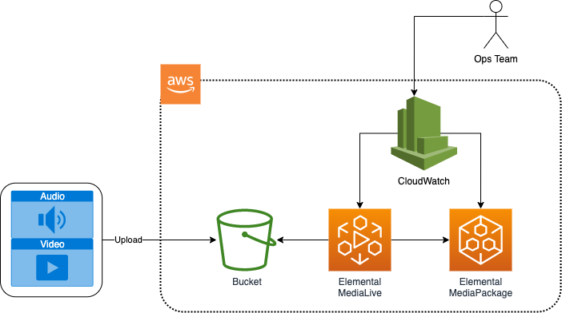

# Live Stream monitoring using CloudWatch Metrics
## Log
| Date        | Entry   | Version | Comment                             |
|-------------|:-------:|:-------:|-------------------------------------|
| 26/04/2023  | created | 0.0.1   | initial release of the application  | 
| 24/08/2023  | update | 0.0.2   | Change CDK app formatting  | 

## Disclaimer 

The sample code; software libraries; command line tools; proofs of concept; templates; or other related technology is provided to you as AWS Content under the AWS Customer Agreement, or the relevant written agreement between you and AWS (whichever applies). You are responsible for testing, securing, and optimizing the AWS Content, such as sample code, as appropriate for production grade use based on your specific quality control practices and standards. You should not use this AWS Content in your production accounts, or on production or other critical data. Deploying AWS Content may incur AWS charges for creating or using AWS chargeable resources, such as running AWS Elemental Live Channels or using AWS Elemental MediaPackage.

## Table of content
- [Solution overview](#solution)
- [Use case](#use_case)
- [Architecture](#architecture)
- [CDK deployment](#cdk)
- [Deployment](#deployment)
- [Known issues](#known_issues)
- [File structure](#files_structure)
- [Tutorial](#tutorial)
- [License](#license)

<a name="solution"></a>
## Solution overview
Solution to provide a way to monitor metrics produced by Elemental MediaLive and MediaPackage through CloudWatch Metrics.
This solution deploys an encoding stack, and also a monitoring stack in which a CloudWatch dashboard is created with the metrics to help an operational team monitor linear channels.

<a name="architecture"></a>
## Architecture

### Code Sample Architecture



<a name="cdk"></a>
## CDK deployment
Visit our [AWS cloud Development Kit](https://aws.amazon.com/cdk/) for more information on CDK.
Get hands-on with CDK running the [CDK introduction workshop](https://cdkworkshop.com/30-python.html).
For this project we will make use of [Typescript version of CDK](https://docs.aws.amazon.com/cdk/v2/guide/work-with-cdk-typescript.html). 
We will create a Typescript app using CDK, this app will abstract all the CloudFormation stack and resource creation.
More information on [CDK best practice](https://docs.aws.amazon.com/cdk/latest/guide/best-practices.html#best-practices-apps) can be found on AWS website.
### Requirements
* [Create an AWS account](_https__:__//portal.aws.amazon.com/gp/aws/developer/registration/index.html_) if you do not already have one and log in. The IAM user that you use must have sufficient permissions to make necessary AWS service calls and manage AWS resources.
* [AWS CLI](_https__:__//docs.aws.amazon.com/cli/latest/userguide/install-cliv2.html_) installed and configured
* [Git Installed](_https__:__//git-scm.com/book/en/v2/Getting-Started-Installing-Git_)
* [AWS Cloud Development Kit](_https__:__//docs.aws.amazon.com/cdk/v2/guide/getting_started.html_) (AWS CDK >= 2.2.0) Installed
* Language used: *Typescript*
* Framework: *AWS CDK*
### Deployment Instructions

1. Create a new directory, navigate to that directory in a terminal and clone the GitHub repository:
```bash
git clone https://github.com/aws-samples/aws-cdk-mediaservices-refarch
```

2. Change directory to the pattern directory:
```bash
cd LIVE_CW_MONITOR
```

3. Install node modules:
```bash
npm install
```

4. Create a bucket in your account, and upload a file to be used as input on the workflow

5. Update your configuration in `config.ts` to work in your account - you will need to provide the bucket name and file name created/uploaded in the previous step.

6. Deploy Media Stack
```bash
npm run cdk deploy MediaServicesRefArch-live-cw-monitoring-encoding-stack
```

7. Deploy Monitoring Stack
```bash
npm run cdk deploy MediaServicesRefArch-live-cw-monitoring-stack
```

## Running the solution

Once your system is deployed and configured correctly, you'll need to start the following:
- MediaLive channel

You'll be able to find the name of your new monitoring dashboard in the outputs on the CloudFormation Stack.

### Cleanup
1. Stop MediaLive channel
2. Delete the stacks

<a name="tutorial"></a>
## Tutorial
See [this useful workshop](https://cdkworkshop.com/20-typescript.html) on working with the AWS CDK for typescript projects.
More about AWS CDK v2 reference documentation [here](https://docs.aws.amazon.com/cdk/api/v2/).
### Useful commands

 * `npm run build`   compile typescript to js
 * `npm run watch`   watch for changes and compile
 * `npm run test`    perform the jest unit tests
 * `cdk ls`          list all stacks in the app
 * `cdk synth`       emits the synthesized CloudFormation template
 * `cdk deploy`      deploy this stack to your default AWS account/region
 * `cdk diff`        compare deployed stack with current state
 * `cdk docs`        open CDK documentation
 * `cdk deploy`      deploy this stack to your default AWS account/region
 * `cdk diff`        compare deployed stack with current state
 * `cdk synth`       emits the synthesized CloudFormation template

### Best practice
* **Security**:
Content security is key to the success of a streaming platform. So make sure to make use of encryption at rest for your assets with the bucket encryption capabilities and secure the transport of your content with https or s3ssl protocols. Ensure you have authentication and authorization in place at a level commensurate with the sensitivity and regulatory requirements of your assets. Consider using MFA whenever possible to access your resources. Where possible access logging should also be enabled and encrypted.
* **Reliability**: 
For demos and debugging purpose this solution run a single pipeline to process your content. 
However, in a production environment make sure to remove any single point of failure by using the STANDARD mode  which allows for dual pipeline creation to process your content in the cloud. 
* **Operation**: 
Enabling logs on the channel will give you more insight on what is happening in your infrastructure should you need to investigate any issue.
You can enhance your CDK application with API calls to automate operational tasks based on triggers. 
* **Cost**: 
Review your encoding settings to optimize your ABR ladder.
Consider reservation for 24/7 workflow.
Make use of bandwidth optimized control rate such as QVBR to save bandwidth on CDN usage when possible.

<a name="license"></a>
## License
This library is licensed under the MIT-0 License. See the LICENSE file.
