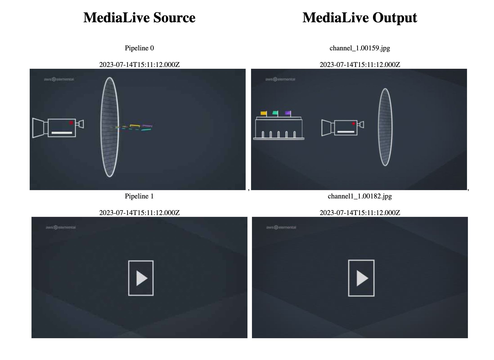
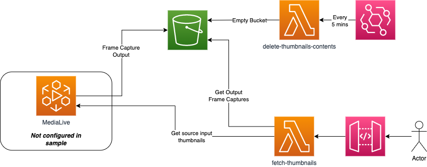
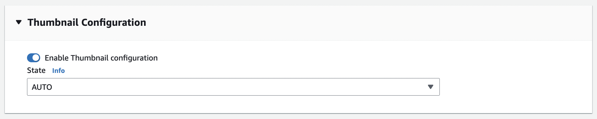
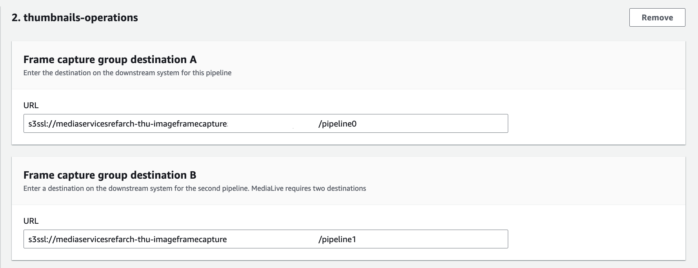
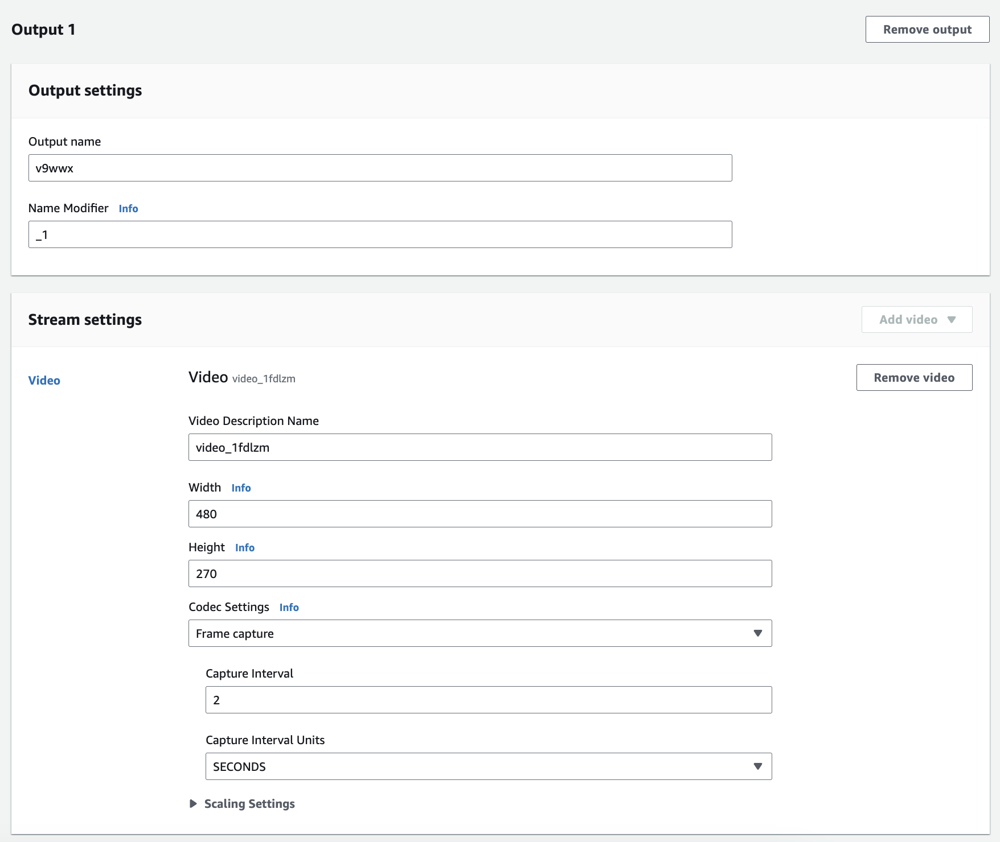

# MediaLive Input & Output Monitoring Example
## Log
| Date        | Entry   | Version | Comment                             |
|-------------|:-------:|:-------:|-------------------------------------|
| 27/08/2023  | created | 0.0.1   | initial release of the application  | 

## Disclaimer 

The sample code; software libraries; command line tools; proofs of concept; templates; or other related technology is provided to you as AWS Content under the AWS Customer Agreement, or the relevant written agreement between you and AWS (whichever applies). You are responsible for testing, securing, and optimizing the AWS Content, such as sample code, as appropriate for production grade use based on your specific quality control practices and standards. You should not use this AWS Content in your production accounts, or on production or other critical data. Deploying AWS Content may incur AWS charges for creating or using AWS chargeable resources, such as running AWS Elemental Live Channels or using AWS Elemental MediaPackage.

## Table of content
- [Solution overview](#solution)
- [Use case](#use_case)
- [Architecture](#architecture)
- [CDK deployment](#cdk)
- [Deployment](#deployment)
- [Known issues](#known_issues)
- [File structure](#files_structure)
- [Tutorial](#tutorial)
- [License](#license)

<a name="solution"></a>
## Solution overview
This code sample is to provide a small "Proof of Concept" on what is possible using MediaLive Thumbnails and Frame Capture on output to monitor your input and output respectively. You might want to use this for confidence monitoring of your MediaLive channel - however to keep this simple, it does not cover all use cases (i.e. input channel loss etc.). Also please read the "Important Information" below around TPS limits.
This solution uses a Rest API to return a HTML templated response with base64 image data embedded.

### Important Information

To make this sample easier to deploy to your test account it performs look-ups in your MediaLive channel configuration to find outputs configured with `operations` in it's title so it can construct the right key when fetching a file from S3. Because it is decribing the channel on every refresh, be careful with your TPS. You may want to remove this lookup when constructing your own solution.

<a name="use_case"></a>
## Use case
Within your operations team, you may require to monitor the input and output of MediaLive - since the [introduction of Thumbnails on input](https://aws.amazon.com/about-aws/whats-new/2023/07/aws-elemental-medialive-input-thumbnail-images/), this allows you to monitor both sides of the encode process.



<a name="architecture"></a>
## Architecture

### Code Sample Architecture
For this sample, we have broken it down to be simpler with less architecture in the account:



<a name="cdk"></a>
## Prerequisite

1. The API created by this sample is protected by an IAM Role - this means you'll have to view the output from the API Gateway with a tool like Postman or Insomnia.
Simply just assumed the role (is in the output of the stack) and use the credentials to execute the API.

2. For this sample to work - you need to firstly enable a channel with the thumbnail feature (not currently supported in CloudFormation so not part of this sample).

General Settings > Thumbnail Configuration:


3. There are a few sample specific configurations you need to also consider when deploying this sample:
a. when you create a "frame capture" output - you need to include in the name `operations` this allows the lambda fetch the right output data
b. when creating you MediaLive channel, you will have to make is how frequent you want thumbnails to be delivered to your S3 bucket - at time of writing this, we used 2 seconds to match the frequency of the input Thumbnail automatic generation
c. for the frame capture we used 270x480 for testing as this matched the output from MediaLive automatically generated thumbnails

Frame Capture Output:


Frame Capture Output Settings:


## CDK deployment
Visit our [AWS cloud Development Kit](https://aws.amazon.com/cdk/) for more information on CDK.
Get hands-on with CDK running the [CDK introduction workshop](https://cdkworkshop.com/30-python.html).
For this project we will make use of [Typescript version of CDK](https://docs.aws.amazon.com/cdk/v2/guide/work-with-cdk-typescript.html). 
We will create a Typescript app using CDK, this app will abstract all the CloudFormation stack and resource creation.
More information on [CDK best practice](https://docs.aws.amazon.com/cdk/latest/guide/best-practices.html#best-practices-apps) can be found on AWS website.
### Requirements
* [Create an AWS account](_https__:__//portal.aws.amazon.com/gp/aws/developer/registration/index.html_) if you do not already have one and log in. The IAM user that you use must have sufficient permissions to make necessary AWS service calls and manage AWS resources.
* [AWS CLI](_https__:__//docs.aws.amazon.com/cli/latest/userguide/install-cliv2.html_) installed and configured
* [Git Installed](_https__:__//git-scm.com/book/en/v2/Getting-Started-Installing-Git_)
* [AWS Cloud Development Kit](_https__:__//docs.aws.amazon.com/cdk/v2/guide/getting_started.html_) (AWS CDK >= 2.2.0) Installed
* Language used: *Typescript*
* Framework: *AWS CDK*
### Deployment Instructions
1. Create a new directory, navigate to that directory in a terminal and clone the GitHub repository:
```bash
git clone https://github.com/aws-samples/aws-cdk-mediaservices-refarch
```
2. Change directory to the pattern directory:
```bash
cd 
```
3. Install node modules:
```bash
npm install
```

4. Build CDK App
```bash
npm run build
```

5. Deploy Media Stack
```bash
npm run cdk deploy
```

### Cleanup

1. Delete the stacks

<a name="tutorial"></a>
## Tutorial
See [this useful workshop](https://cdkworkshop.com/20-typescript.html) on working with the AWS CDK for typescript projects.
More about AWS CDK v2 reference documentation [here](https://docs.aws.amazon.com/cdk/api/v2/).
### Useful commands

 * `npm run build`   compile typescript to js
 * `npm run watch`   watch for changes and compile
 * `npm run test`    perform the jest unit tests
 * `cdk ls`          list all stacks in the app
 * `cdk synth`       emits the synthesized CloudFormation template
 * `cdk deploy`      deploy this stack to your default AWS account/region
 * `cdk diff`        compare deployed stack with current state
 * `cdk docs`        open CDK documentation
 * `cdk deploy`      deploy this stack to your default AWS account/region
 * `cdk diff`        compare deployed stack with current state
 * `cdk synth`       emits the synthesized CloudFormation template

### Best practice
* **Security**:
Content security is key to the success of a streaming platform. So make sure to make use of encryption at rest for your assets with the bucket encryption capabilities and secure the transport of your content with https or s3ssl protocols. Ensure you have authentication and authorization in place at a level commensurate with the sensitivity and regulatory requirements of your assets. Consider using MFA whenever possible to access your resources.
* **Reliability**: 
For demos and debugging purpose this solution run a single pipeline to process your content. 
However, in a production environment make sure to remove any single point of failure by using the STANDARD mode  which allows for dual pipeline creation to process your content in the cloud. 
* **Operation**: 
Enabling logs on the channel will give you more insight on what is happening in your infrastructure should you need to investigate any issue.
You can enhance your CDK application with API calls to automate operational tasks based on triggers. 
* **Cost**: 
Review your encoding settings to optimize your ABR ladder.
Consider reservation for 24/7 workflow.
Make use of bandwidth optimized control rate such as QVBR to save bandwidth on CDN usage when possible.

<a name="license"></a>
## License
This library is licensed under the MIT-0 License. See the LICENSE file.


