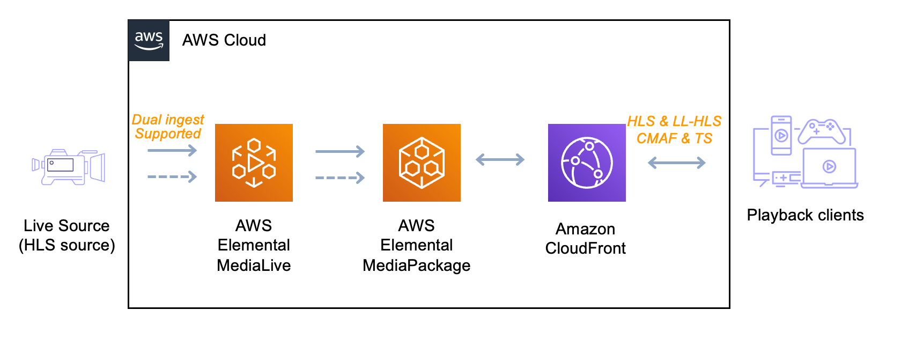

# Live OTT Low Latency workflow (OTT_LOW_LATENCY) using MediaLive, MediaPackage and CloudFront

## Log

| Date       |  Entry  | Version | Comment                                              |
| ---------- | :-----: | :-----: | ---------------------------------------------------- |
| 11/10/2022 | created |  0.0.1  | initial release of the application                   |
| 01/06/2023 | update  |  0.0.2  | adding CMAF output                                   |
| 07/11/2023 | update  |  0.1.0  | Forked OTT project to integrate with MediaPackage V2 |

## Disclaimer

The sample code; software libraries; command line tools; proofs of concept; templates; or other related technology is provided to you as AWS Content under the AWS Customer Agreement, or the relevant written agreement between you and AWS (whichever applies). You are responsible for testing, securing, and optimizing the AWS Content, such as sample code, as appropriate for production grade use based on your specific quality control practices and standards. You should not use this AWS Content in your production accounts, or on production or other critical data. Deploying AWS Content may incur AWS charges for creating or using AWS chargeable resources, such as running AWS Elemental Live Channels or using AWS Elemental MediaPackage.

## Prerequisites

<a name="prerequisites"></a>
Before you start with this project make sure you are familiar with the following tools:

- AWS CLI v2
- AWS CDK v2 Installed and [bootstrapped](https://docs.aws.amazon.com/cdk/v2/guide/bootstrapping.html)
- AWS SDK for Python

## Table of content

- [Solution overview](#solution)
- [Architecture](#architecture)
- [CDK deployment](#cdk)
- [Deployment](#deployment)
- [Known issues](#known_issues)
- [File structure](#files_structure)
- [Tutorial](#tutorial)
- [License](#license)

<a name="solution"></a>

## Solution overview

This pattern creates an End to End (E2E) live streaming stack leveraging AWS Elemental MediaServices using AWS Elemental MediaLive, MediaPackage Version 2 and Amazon CloudFront distribution.
This is sample CDK code in typescript to automate the deployment of an E2E Live workflow on AWS. This workflow will output both standard and low latency HLS and CMAF endpoints for playback.
The code is highly customizable to address the Live source required for your projects. By default, the sample code is using a HLS live demonstration feed.
You can easily modify the settings of each service using configuration in json format and modifying the CDK code to change which MediaServices to use.
This is a complete example that will build a MediaLive channel, a MediaPackage Channel and a CloudFront distribution to play your content.
The generated channel can then be used for testing and debugging purposes allowing you to familiarise yourself with building and writing media infrastructure as code.

> [!WARNING]
> This sample workflow does _NOT_ implement authentication on the AWS Elemental MediaPackage Endpoints and these endpoints are accessible from the public internet. For production workloads it is highly recommended to enable authentication on MediaPackage endpoints (see [Authenticating Requests (AWS Signature Version 4)](https://docs.aws.amazon.com/mediapackage/latest/userguide/sig-v4-authenticating-requests.html)). Once enabled the CDN needs to be configured to sign requests being sent to MediaPackage. At a later date this project will be updated to enable authentication on MediaPackage endpoints and deliver the content via CloudFront.

While deploying this code you will be making use of the following services which could incur charges in your account:

- [MediaLive (EML)](https://aws.amazon.com/medialive/pricing/)
- [MediaPackage (EMP)](https://aws.amazon.com/fr/mediapackage/pricing/)
- [CloudFront](https://aws.amazon.com/fr/cloudfront/pricing/)
- [CloudFormation (CFN)](https://aws.amazon.com/cloudformation/pricing/)

<a name="architecture"></a>

## Architecture

Here is the architecture diagram for this application



The Live source can be either of the following formats : UDP*PUSH|RTP_PUSH|RTMP_PUSH|RTMP_PULL|URL_PULL|MP4_FILE|INPUT_DEVICE|TS_FILE|MEDIACONNECT
All the configuration parameters for the stack are available in the \_config/configuration.json* file. Only the name of the stack and the description are set as [AWS CDK context](https://docs.aws.amazon.com/cdk/v2/guide/context.html).

### Naming Convention

_NB_- During deployment, the CDK stack will name resources based on the [STACKNAME] + [COMPONENT] separated by underscores. e.g if the stackname is set to _OTT-LL_ and all other defaults are kept, the MediaLive Input Name will be _OTT-LL_URL_PULL_MediaLiveInput_. Bare this in mind, If deploying this into an account with existing MediaLive and MediaPackage resources.

## AWS Elemental MediaLive

[AWS Elemental MediaLive](https://aws.amazon.com/medialive/) is a Live transcoder and will be used to generate the Adaptive Bitrate (ABR) ladder to push into MediaPackage.
The CDK file to deploy EML is located in _lib/medialive.ts_.
The configuration for EML is located in the [mediaLive](config/configuration.json) section of the [config/configuration.json](config/configuration.json) file.

#### AWS Elemental MediaLive - Configuration Parameters

The following table provides details of all the available MediaLive configuration parameters within the [config/configuration.json](config/configuration.json) file that can be adjusted prior to deployment.

| Parameter           | Description                                                                   | Default Value                                     | Documentation Reference                                                                                                               |
| ------------------- | ----------------------------------------------------------------------------- | ------------------------------------------------- | ------------------------------------------------------------------------------------------------------------------------------------- |
| "autoStart"         | Sets the MediaLive channel starting behaviour                                 | "True"                                            | [Starting the channel](https://docs.aws.amazon.com/medialive/latest/ug/starting-stopping-deleting-a-channel.html)                                     |
| "channelClass"      | Determines if a dual or single pipeline configuation is used                  | "STANDARD"                                        | [Channel Class](https://docs.aws.amazon.com/medialive/latest/ug/channel-class.html)                                                   |
| "inputType"         | Determines the input source used in your MediaLive channel                    | "URL_PULL"                                        | [Channel Inputs](https://docs.aws.amazon.com/medialive/latest/ug/attach-inputs-procedure.html)                                        |
| "sourceEndBehavior" | Sets the default behaviour when your input source ends                        | "LOOP"                                            | [Channel Inputs](https://docs.aws.amazon.com/medialive/latest/ug/attach-inputs-procedure.html)                                        |
| "codec"             | Sets the input specification codec                                            | "AVC"                                             | [Supported Codecs](https://docs.aws.amazon.com/medialive/latest/ug/inputs-supported-containers-and-codecs.html)                       |
| "encodingProfile"   | Determines the encoding profile settings. See note below for Custom Templates | "HD-720p"                                         | [Custom Templates](https://docs.aws.amazon.com/medialive/latest/ug/creating-channel-template.html#using-custom-templatechannelClasss) |
| "inputCidr"         | The AllowList CIDR on the Input Security Group                                | "0.0.0.0/0"                                       | [Input Security Groups](https://docs.aws.amazon.com/medialive/latest/ug/working-with-input-security-groups.html)                      |
| "priUrl"            | The URL of Input Source A                                                     | "../live_stream_v2/sports_reel_with_markers.m3u8" | [Channel Inputs](https://docs.aws.amazon.com/medialive/latest/ug/attach-inputs-procedure.html)                                        |
| "secUrl"            | The URL of Input Source B                                                     | "../live_stream_v2/sports_reel_with_markers.m3u8" | [Channel Inputs](https://docs.aws.amazon.com/medialive/latest/ug/attach-inputs-procedure.html)                                        |
|                     |                                                                               |                                                   |                                                                                                                                       |
| "streamName"        | Specifies the RTMP_PUSH Stream name (a.k.a. Application Name) if used.        | None                                              | [RTMP Push Input](https://docs.aws.amazon.com/medialive/latest/ug/origin-server-rtmp.html)                                          |
| "priFlow"           | The Media Connect Primary Destination URL if used                             | None                                              | [MediaConnect Input](https://docs.aws.amazon.com/medialive/latest/ug/input-create-push-mediaconnect.html)                             |
| "secFlow"           | The Media Connect Secondary Destination URL if used                           | None                                              | [MediaConnect Input](https://docs.aws.amazon.com/medialive/latest/ug/input-create-push-mediaconnect.html)                             |
| "priLink"           | The Link Devices Primarly Id, if used                                         | None                                              | [Elemental Link](https://docs.aws.amazon.com/medialive/latest/ug/input-create-link-device.html)                                       |
| "secLink"           | The Link Devices Secondary Id, if used                                        | None                                              | [Elemental Link ](https://docs.aws.amazon.com/medialive/latest/ug/input-create-link-device.html)                                      |

*Note:* AWS_CDI not implemented yet and MediaLive will push directly to MediaPackage.

Update the parameters in the _mediaLive_ section in the file _config/configuration.json_ according to your options:

```json
{
  "autoStart": false|true,
  "streamName": "PUT_YOUR_RTMP_STREAM-NAME_HERE",
  "channelClass": "STANDARD|SINGLE_PIPELINE",
  "inputType": "UDP_PUSH|RTP_PUSH|RTMP_PUSH|RTMP_PULL|URL_PULL|MP4_FILE|INPUT_DEVICE|TS_FILE|MEDIACONNECT",
  "sourceEndBehavior" : "LOOP|CONTINUE",
  "codec": "AVC|HEVC",
  "encodingProfile": "HD-1080p|HD-720p|SD-540p|...",
  "priLink": "PUT_YOUR_PRIMARY_LINK-ID_HERE",
  "secLink": "PUT_YOUR_SECONDARY_LINK-ID_HERE",
  "inputCidr": "PUT_YOUR_CIDRs_BLOCKS" ,
  "priUrl": "PUT_YOUR_PRIMARY_URL_HERE",
  "secUrl": "PUT_YOUR_SECONDARY_URL_HERE",
  "priFlow": "PUT_YOUR_PRIMARY_MEDIACONNECT_HERE",
  "secFlow": "PUT_YOUR_SECONDARY_MEDIACONNECT_HERE"
}
```

You can create your own encoding profiles using custom template in MediaLive. As an example, there are 3 encoding profiles available and you can select them by updating the value from the **encodingProfile** key in _configurationMediaLive_. The files are located in :

- **HD-1080p** profile: 1920x1080, 1280x720, 960x540, 768x432, 640x360, 512x288 => _config/encoding-profiles/hd-1080p-30fps.json_
- **HD-720p** profile: 1280x720, 960x540, 640x360, 512x288 => _config/encoding-profiles/hd-720p-25fps.json_
- **SD-540p** profile: 960x540, 768x432, 640x360, 512x288 => _config/encoding-profiles/sd-540p-30fp.json_

You can easily create your own template by downloading the [custom template](https://docs.aws.amazon.com/medialive/latest/ug/creating-channel-template.html#using-custom-templates) from the console. You would need to place the json file in the _config/encoding-profiles/_ folder.

## **AWS Elemental MediaPackage**

[AWS Elemental MediaPackage](https://aws.amazon.com/mediapackage/) is a Just In Time Packager used to package into Adaptive Streaming format like MPEG-DASH, HLS, CMAF and SmoothStreaming.
The CDK file to deploy EMP is located in _lib/mediapackagev2.ts_.

### **MediaPackage V2 Notes**

To achieve the latencies and performance requirements to support LL-HLS (Introduced by Apple in 2019) and allow us to integrate with other AWS services for authentication, throttling, encryption-at-rest, a new MediaPackage endopint API was introduced. This is knownn as EMP v2

EMP v2 also introduces a new API model, with a new resource type (channel group) that simplifies CDN configuration for customers, by providing a single DNS domain for all channels created in a group. The API has many other changes, like predictable ingest and playback URLs, multiple manifests per endpoint, and forward-looking support for CMAF segments with shared HLS and DASH manifests.

V2 currently only supports the following features (w.r.t. V1 parity):

Ingest:

- HLS/TS from Elemental Live and MediaLive

Egress/packaging:

- Segment containers: TS, CMAF
- Manifests: HLS
- Video: AVC, HEVC
- Audio: AAC, AC-3, EAC-3 too I think?
- WebVTT, 608/708 CC, HDR, ID3 (CMAF only I think?)
- Manifest filtering query params
- DRM, SCTE35 (more details below)

V2 currently supports the following new features:

- SigV4 auth on ingest and egress, IAM resource policies
- LL-HLS manifests on endpoints
- Multiple parent manifests per origin endpoint
- SPEKE V2 DRM with key rotation (including TS segments)
- I-frame playlists on all renditions, can be filtered via query parameters

The following features are currenetly NOT supported in V2:

- No DASH or MSS
- No Speke v1
- No Live-to-VOD Harvester
- No CloudWatch Logs or Events
- No raiseable Quotas

#### AWS Elemental MediaPackage - Configuration Parameters

The following table provides details of all the available MediaPackage configuration parameters within the [config/configuration.json](config/configuration.json) file that can be adjusted prior to deployment.

| Parameter                        | Description                                                               | Default Value | Documentation Reference                                                                                        |
| -------------------------------- | ------------------------------------------------------------------------- | ------------- | -------------------------------------------------------------------------------------------------------------- |
| "ad_markers"                     | Sets how ad markers are included in the packaged endpoint.                | "DATERANGE"   | [HLS Packager Settings](https://docs.aws.amazon.com/mediapackage/latest/ug/endpoints-hls-packager.html)        |
| "hls_segment_duration_seconds"   | Sets th duration (in seconds) of each fragment.                           | "4"           | [HLS Packager Settings](https://docs.aws.amazon.com/mediapackage/latest/ug/endpoints-hls-packager.html)        |
| "hls_playlist_window_seconds"    | Sets the Time window (in seconds) contained in each parent manifest.      | "60"          | [HLS Packager Settings](https://docs.aws.amazon.com/mediapackage/latest/ug/endpoints-hls-packager.html)        |
| "hls_include_I_frame"            | Sets if only HTML iframe formatted streams are included                   | "True"        | [HLS Packager Settings](https://docs.aws.amazon.com/mediapackage/latest/ug/endpoints-hls-packager.html)        |
| "hls_audio_rendition_group"      | When True, MediaPackage bundles all audio tracks in a rendition group     | "True"        | [HLS Packager Settings](https://docs.aws.amazon.com/mediapackage/latest/ug/endpoints-hls-packager.html)        |
| "hls_program_date_interval"      | Sets the interval for EXT-X-PROGRAM-DATE-TIME tags in the output manifest | "60"          | [HLS Packager Settings](https://docs.aws.amazon.com/mediapackage/latest/ug/endpoints-hls-packager.html)        |
|                                  |                                                                           |               |                                                                                                                |
| "cmaf_segment_duration_seconds"  | Sets the duration (in seconds) of each fragment.                          | None          | [CMAF Packager Settings](https://docs.aws.amazon.com/mediapackage/latest/ug/endpoints-cmaf-packager.html)      |
| "cmaf_include_I_frame"           | Sets if only HTML iframe formatted streams are included                   | None          | [CMAF Packager Settings](https://docs.aws.amazon.com/mediapackage/latest/ug/endpoints-cmaf-packager.html)      |
| "cmaf_program_date_interval"     | Sets the interval for EXT-X-PROGRAM-DATE-TIME tags in the output manifest | "60"          | [CMAF Packager Settings](https://docs.aws.amazon.com/mediapackage/latest/ug/endpoints-cmaf-packager.html)      |
| "cmaf_playlist_window_seconds"   | Sets the Time window (in seconds) contained in each parent manifest.      | "60"          | [CMAF Packager Settings](https://docs.aws.amazon.com/mediapackage/latest/ug/endpoints-cmaf-packager.html)      |

Update the _mediaPackage_ parameter in the file _config/configuration.json_ according to your options:

```json
{
  "ad_markers":"DATERANGE|NONE",
  "hls_segment_duration_seconds": 4,
  "hls_playlist_window_seconds": 60,
  "hls_include_I_frame":false|true,
  "hls_audio_rendition_group": false|true,
  "hls_program_date_interval":60,

  "cmaf_segment_duration_seconds": 4,
  "cmaf_include_I_frame":false|true,
  "cmaf_program_date_interval":60,
  "cmaf_playlist_window_seconds": 60
}
```

By default, the solution will create HLS and CMAF outputs with SCTE35 in DATERANGE mode.

### Amazon CloudFront

[Amazon CloudFront](https://aws.amazon.com/cloudfront/) is a fast content delivery network (CDN) service that can scale to deliver high-quality streaming experiences to millions of concurrent viewers.
A CloudFront distribution will be used to offload and secure MediaPackage Origin.

#### Origins

There is a single origin:

- **MediaPackage** Origin: to deliver all the chunks/fragments from the Live feed (cacheable).

#### Cache Behaviors

- **\*.m3u8** => _MediaPackage_ Origin with caching enabled for HLS/CMAF manifests
- **Default (\*)** => _MediaPackage_ Origin with caching enabled for media FRAGMENTS
  NB: there are multiple ways to implement cache behaviors for Live streaming, this is just an example.

HLS and CMAF use the same formate for manifest URLs. The formate is:
_https://< hostname-cloudfront >/out/v1/< channel-group >/< channel-name >/< origin-endpoint-id >/< manifest-name >.m3u8_

<a name="cdk"></a>

## CDK deployment

Visit our [AWS cloud Development Kit](https://aws.amazon.com/cdk/) for more information on CDK.
Get hands-on with CDK running the [CDK introduction workshop](https://cdkworkshop.com/20-typescript.html).
For this project we will make use of [Typescript version of CDK](https://docs.aws.amazon.com/cdk/v2/guide/work-with-cdk-typescript.html).
We will create a Typescript app using CDK, this app will abstract all the CloudFormation stack and resource creation.
More information on [CDK best practice](https://docs.aws.amazon.com/cdk/latest/guide/best-practices.html#best-practices-apps) can be found on AWS website.

### Requirements

- [Create an AWS account](_https://portal.aws.amazon.com/gp/aws/developer/registration/index.html) if you do not already have one and log in. The IAM user that you use must have sufficient permissions to make necessary AWS service calls and manage AWS resources.
- [AWS CLI](_https://docs.aws.amazon.com/cli/latest/userguide/install-cliv2.html) installed and configured
- [Git Installed](https://git-scm.com/book/en/v2/Getting-Started-Installing-Git)
- [AWS Cloud Development Kit](https://docs.aws.amazon.com/cdk/v2/guide/getting_started.html) (AWS CDK >= 2.2.0) Installed
- Language used: _Typescript_
- Framework: _AWS CDK_

### Deployment Instructions

1. Create a new directory, navigate to that directory in a terminal and clone the GitHub repository:

```bash
git clone https://github.com/aws-samples/aws-cdk-mediaservices-refarch
```

2. Change directory to the pattern directory:

```bash
cd OTT_LOW_LATENCY
```

3. Install node modules:

```bash
npm install
```

4. From the command line, use CDK to deploy the stack:

```bash
cdk deploy [--context stackName=""] [-c stackDescription=""] [--outputs-file ./cdk-exports.json] [--no-rollback] [--require-approval never] [--profile AWS_PROFILE]
```

5. Output should be:

```bash
MedialiveMediapackageCloudfrontStack.MyCloudFrontS3LogBucket =
MedialiveMediapackageCloudfrontStack.MyCmafPlaybackUrl =
MedialiveMediapackageCloudfrontStack.MyHlsPlaybackUrl =
MedialiveMediapackageCloudfrontStack.MyLlCmafPlaybackUrl =
MedialiveMediapackageCloudfrontStack.MyLlHlsPlaybackUrl =
MedialiveMediapackageCloudfrontStack.MyMediaLiveChannelMyMediaLiveChannelArn9444DEE8 =
MedialiveMediapackageCloudfrontStack.MyMediaLiveChannelMyMediaLiveChannelInputName06358C44 =
MedialiveMediapackageCloudfrontStack.MyMediaPackageChannelName =
[MedialiveMediapackageCloudfrontStack.MyMediaLiveChannelDestPri = ]
[MedialiveMediapackageCloudfrontStack.MyMediaLiveChannelDestSec = ]
```

### Testing

1. Start the MediaLive Channel

```bash
MediaLiveChannel=$(cat cdk-exports.json  | grep  'MyMediaLiveChannelArn' | awk -F'"' '{print $4}' | grep -oE "[^:]+$")
aws --no-cli-pager medialive start-channel --channel-id $MediaLiveChannel
#Wait for the channel to start
while true ; do CHANNEL_STATUS=`aws --no-cli-pager medialive describe-channel --channel-id $MediaLiveChannel --query "State" --output text ` ; if [ $CHANNEL_STATUS == "RUNNING" ] ; then echo "Channel $MediaLiveChannel is started" ; break ; else echo "Channel $MediaLiveChannel is not started"; fi ; sleep 5 ; done
```

2. Playing URLs
   Use any HLS player to play the HLS output from the _MyHlsPlaybackUrl_ output value.
   Use any HLS player supporting CMAF to play the HLS output from the _MyCmafPlaybackUrl_ output value.
   Low latency versions of the HLS and CMAF streams are also provided in the _MyLlHlsPlaybackUrl_ and _MyLlCmafPlaybackUrl_ output values.

### Cleanup

1. Stop Media Live channel

```bash
aws --no-cli-pager medialive stop-channel --channel-id $MediaLiveChannel
#Wait for the channel to stop
while true ; do CHANNEL_STATUS=`aws --no-cli-pager medialive describe-channel --channel-id $MediaLiveChannel --query "State" --output text` ; if [ $CHANNEL_STATUS == "IDLE" ] ; then echo "Channel $MediaLiveChannel is stopped" ; break ; else echo "Channel $MediaLiveChannel is not stopped"; fi ; sleep 5 ; done
```

2. Delete the stack

```bash
cdk destroy
```

### TLDR

```bash
#!/bin/bash

echo "Cloning repository :"
git https://github.com/aws-samples/aws-cdk-mediaservices-refarch && cd OTT_LOW_LATENCY
echo "Install node dependencies :"
npm install
AWS_PROFILE="default"
echo "Deploying cdk stack :"
npx aws-cdk@2.x deploy --outputs-file ./cdk-exports.json --profile $AWS_PROFILE --no-rollback --require-approval never

#Extracting value from CDK output
MediaLiveChannel=$(cat cdk-exports.json  | grep  'MyMediaLiveChannelArn' | awk -F'"' '{print $4}' | grep -oE "[^:]+$")
HlsPlaybackUrl=$(cat cdk-exports.json | grep "MyHlsPlaybackUrl" | awk -F'"' '{print $4}')
LowLatencyHlsPlaybackUrl=$(cat cdk-exports.json | grep "MyLlHlsPlaybackUrl" | awk -F'"' '{print $4}')
CmafPlaybackUrl=$(cat cdk-exports.json | grep "MyCmafPlaybackUrl" | awk -F'"' '{print $4}')
LowLatencyCmafPlaybackUrl=$(cat cdk-exports.json | grep "MyLlCmafPlaybackUrl" | awk -F'"' '{print $4}')
LogBucketName=$(cat cdk-exports.json | grep "MyCloudFrontS3LogBucket" | awk -F'"' '{print $4}')

echo "Starting MediaLive Channel :"
StartMediaLive=$(aws --no-cli-pager medialive start-channel --channel-id $MediaLiveChannel --profile $AWS_PROFILE)
#Wait for the channel to start
while true ; do CHANNEL_STATUS=`aws medialive describe-channel --channel-id $MediaLiveChannel --profile $AWS_PROFILE --query "State" --output text` ; if [ $CHANNEL_STATUS == "RUNNING" ] ; then echo "Channel $MediaLiveChannel is started" ; break ; else echo "Channel $MediaLiveChannel is not started"; fi ; sleep 5 ; done

echo -e "Playback URL HLS              : \033[1m$HlsPlaybackUrl\033[0m"
echo -e "Playback URL Low Latency HLS  : \033[1m$LowLatencyHlsPlaybackUrl\033[0m"
echo -e "Playback URL CMAF             : \033[1m$CmafPlaybackUrl\033[0m"
echo -e "Playback URL Low Latency CMAF : \033[1m$LowLatencyCmafPlaybackUrl\033[0m"
echo -e "Test hls.js player URL HLS              : \033[1mhttps://hls-js.netlify.app/demo/?src=$HlsPlaybackUrl\033[0m"
echo -e "Test hls.js player URL Low Latency HLS  : \033[1mhttps://hls-js.netlify.app/demo/?src=$LowLatencyHlsPlaybackUrl\033[0m"
echo -e "Test hls.js player URL CMAF             : \033[1mhttps://hls-js.netlify.app/demo/?src=$CmafPlaybackUrl\033[0m"
echo -e "Test hls.js player URL Low Latency CMAF : \033[1mhttps://hls-js.netlify.app/demo/?src=$LowLatencyCmafPlaybackUrl\033[0m"

#Make sure to press the "play" button for hls.js and "load" button for the dash.js

echo "Wait for 5 min before destroying the stack ..."
sleep 300

echo "Stopping MediaLive Channel :"
StopMediaLive=$(aws --no-cli-pager medialive stop-channel --channel-id $MediaLiveChannel --profile $AWS_PROFILE)
#Wait for the channel to stop
while true ; do CHANNEL_STATUS=`aws --no-cli-pager medialive describe-channel --channel-id $MediaLiveChannel --profile $AWS_PROFILE --query "State" --output text` ; if [ $CHANNEL_STATUS == "IDLE" ] ; then echo "Channel $MediaLiveChannel is stopped" ; break ; else echo "Channel $MediaLiveChannel is not stopped"; fi ; sleep 5 ; done

echo "Manually remove S3 buckets to avoid errors when destroying the stack: "
aws s3 rm s3://$LogBucketName --recursive --profile $AWS_PROFILE
echo "Destroying cdk stack :"
cdk destroy --profile $AWS_PROFILE

```

<a name="known_issues"></a>

## Known Issues

Please make sure the associated channel is in idle state before running the destroy command.
You can check your channel status by logging in to your AWS console ==> MediaLive ==> Channel.
Once on the MediaLive Channel dashboard identify your channel and tick the box on the left side of the channel list.
Then click on the button stop and wait for the channel to be in idle state before you proceed with the destroy command.
The stack will automatically destroy the S3 buckets for the CloudFront logs, but if you face an error on deleting the S3 bucket make sure you stopped requesting on the CloudFront distribution. You would need to manually delete the files in the log bucket and then destroy the stack to get the stack completely removed.

<a name="files_structure"></a>

## File structure

```
├── bin
│   └── medialive-mediapackage-cloudfront.ts        [ Core application script ]
├── config
│   ├── configuration.json                          [ Configuration file to change the settings for the stack ]
│   └── encoding-profiles
│       ├── hd-1080p-30fps.json                     [ MediaLive 1080p profile example ]
│       ├── hd-720p-25fps.json                      [ MediaLive 720p profile example ]
│       └── sd-540p-30fps.json                      [ MediaLive 540p profile example ]
├── lib
│   ├── cloudfront.ts                               [ CloudFront construct ]
│   ├── medialive.ts                                [ MediaLive construct ]
│   ├── mediapackagev2.ts                           [ MediaPackage V2 construct ]
│   ├── medialive-mediapackage-cloudfront-stack.ts  [ Core construct file with configuration variable]
│   └── custom_ressources
│       ├── mediapackage-extra-attributes.ts        [ Custom Ressource to retrieve MediaPackage ingest endpoints ]
│       └── medialive-autostart.ts                  [ Custom Ressource to start MediaLive after the stack is deployed ]
│   └── lambda
│       ├── medialive-autostart_start_function      [ Lambda function for the AutoStart Custom Ressource ]
│       └── mediapackage_extra_attrib_function      [ Lambda function to retrieve MediaPackage ingest endpoints ]
├── cdk.json                                        [ AWS CDK context file ]
├── package.json
├── tsconfig.json
├── README.md
└── architecture_AEML-AEMP.png                      [ Architecture diagram ]
```

<a name="tutorial"></a>

## Tutorial

See [this useful workshop](https://cdkworkshop.com/20-typescript.html) on working with the AWS CDK for typescript projects.
More about AWS CDK v2 reference documentation [here](https://docs.aws.amazon.com/cdk/api/v2/).

### Useful commands

- `npm run build` compile typescript to js
- `npm run watch` watch for changes and compile
- `npm run test` perform the jest unit tests
- `cdk ls` list all stacks in the app
- `cdk synth` emits the synthesized CloudFormation template
- `cdk deploy` deploy this stack to your default AWS account/region
- `cdk diff` compare deployed stack with current state
- `cdk docs` open CDK documentation
- `cdk deploy` deploy this stack to your default AWS account/region
- `cdk diff` compare deployed stack with current state
- `cdk synth` emits the synthesized CloudFormation template

### Best practice

- **Security**:
  - Content security is key to the success of a streaming platform. So make sure to make use of encryption at rest for your assets with the bucket encryption capabilities and secure the transport of your content with https or s3 ssl protocols.
  - Ensure you have authentication and authorization in place at a level commensurate with the sensitivity and regulatory requirements of your assets.
  - Consider using MFA whenever possible to access your resources.
- **Reliability**:
  - For demos and debugging purposes this solution runs a single pipeline to process your content. However, in a production environment make sure to remove any single points of failure by using the STANDARD mode which allows for dual pipeline creation to process your content in the cloud.
  - Also consider using a [blue green deployment method](https://docs.aws.amazon.com/whitepapers/latest/overview-deployment-options/bluegreen-deployments.html) as your deployment strategy.
- **Operation**:
  - Enable [Monitoring](https://docs.aws.amazon.com/medialive/latest/ug/monitoring-channels.html) on the channel to give you more insight into what is happening with the infrastructure and assist with triaging problems should you need to investigate any issues.
  - Consider [QoS Observability for OTT Streaming](https://aws.amazon.com/blogs/networking-and-content-delivery/qos-observability-for-ott-streaming-using-amazon-cloudfront/) to get insights into the performance of your Streams.
  - You can enhance your CDK application with API calls to automate operational tasks based on triggers.
- **Cost**:
  - Review your encoding settings to optimize your ABR ladder.
  - Consider reservation for 24/7 workflow.
  - Make use of bandwidth optimized control rate such as QVBR to save bandwidth on CDN usage when possible.

<a name="license"></a>

## License

This library is licensed under the MIT-0 License. See the LICENSE file.
