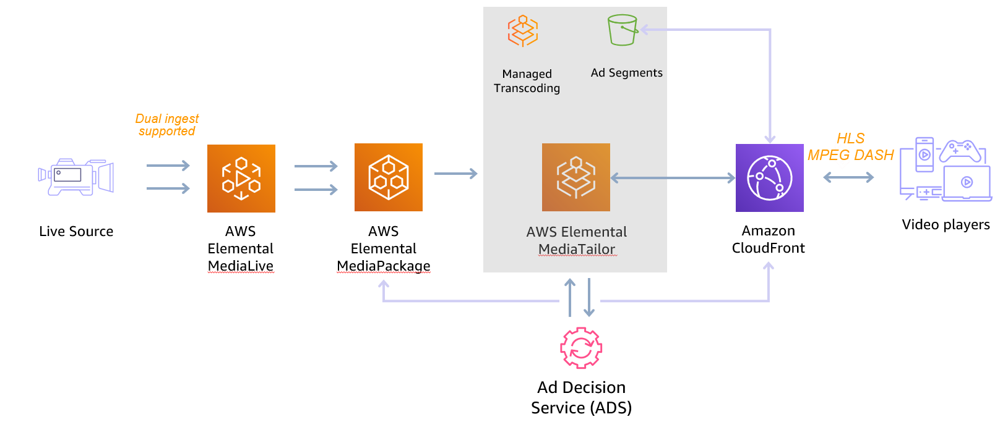

# Live Ad-Insertion workflow (SSAI) using MediaLive, MediaPackage, MediaTailor and CloudFront
## Log
| Date        | Entry   | Version | Comment                             |
|-------------|:-------:|:-------:|-------------------------------------|
| 10/01/2023  | created | 0.0.1   | initial release of the application  | 


## Disclaimer 
The sample code; software libraries; command line tools; proofs of concept; templates; or other related technology is provided to you as AWS Content under the AWS Customer Agreement, or the relevant written agreement between you and AWS (whichever applies). You are responsible for testing, securing, and optimizing the AWS Content, such as sample code, as appropriate for production grade use based on your specific quality control practices and standards. You should not use this AWS Content in your production accounts, or on production or other critical data. Deploying AWS Content may incur AWS charges for creating or using AWS chargeable resources, such as running AWS Elemental Live Channels or using AWS Elemental MediaPackage.

## Table of content
- [Solution overview](#solution)
- [Architecture](#architecture)
- [CDK deployment](#cdk)
- [Deployment](#deployment)
- [Known issues](#known_issues)
- [File structure](#files_structure)
- [Tutorial](#tutorial)
- [License](#license)

<a name="solution"></a>
## Solution overview
This pattern creates an End to End (E2E) live streaming stack leveraging AWS Elemental Media Services using AWS Elemental MediaLive, MediaPackage, MediaTailor and Amazon CloudFront distribution.
This is a sample CDK code in typescript to automate the deployment of an E2E Live workflow on AWS. 
The code is highly customizable to address the Live source required for your projects. By default, the sample code is using a HLS live demonstration feed.
You can easily modify the settings of each service using configuration in json format and modifying the CDK code to change which MediaServices to use.
This is a complete example that will build a MediaLive channel, a MediaPackage Channel, a MediaTailor configuration and a CloudFront distribution to play your content.
The generated channel can then be used for testing and debugging purposes and allowing you to familiarise yourself with building and writing media infrastructure as code.

While deploying this code you will be making use of the following services which could incur charges in your account:
  - [MediaLive (EML)](https://aws.amazon.com/medialive/pricing/)
  - [MediaPackage (EMP)](https://aws.amazon.com/fr/mediapackage/pricing/)
  - [MediaTailor (EMT)](https://aws.amazon.com/fr/mediapackage/pricing/)
  - [CloudFront](https://aws.amazon.com/fr/cloudfront/pricing/)
  - [CloudFormation (CFN)](https://aws.amazon.com/cloudformation/pricing/)


<a name="architecture"></a>
## Architecture
Here is the architecture diagram for this application

The Live source can be either of the following formats : UDP_PUSH|RTP_PUSH|RTMP_PUSH|RTMP_PULL|URL_PULL|MP4_FILE|INPUT_DEVICE|TS_FILE|MEDIACONNECT


### AWS Elemental MediaLive
[AWS Elemental MediaLive](https://aws.amazon.com/medialive/) is a Live transcoder and will be used to generate the ABR ladder to push into MediaPackage.
The CDK file to deploy EML is located in *lib/medialive.ts*.
The configuration for EML is located in the *mediaLive* section from *config/configuration.json*.

In this example, the *URL_PULL* will be used but you can change the configuration json to use any of the following input type:
***UDP_PUSH|RTP_PUSH|RTMP_PUSH|RTMP_PULL|URL_PULL|MP4_FILE|MEDIACONNECT|INPUT_DEVICE|AWS_CDI|TS_FILE***
NB: AWS_CDI not implemented yet and MediaLive will push directly to MediaPackage.

Update the *mediaLive* parameter in the file *config/configuration.json* according to your options:
```json
{
  "autoStart": false|true,
  "streamName": "PUT_YOUR_RTMP_STREAM-NAME_HERE",
  "channelClass": "STANDARD|SINGLE_PIPELINE", 
  "inputType": "UDP_PUSH|RTP_PUSH|RTMP_PUSH|RTMP_PULL|URL_PULL|MP4_FILE|INPUT_DEVICE|TS_FILE|MEDIACONNECT",
  "sourceEndBehavior" : "LOOP|CONTINUE",
  "codec": "AVC|HEVC",
  "encodingProfile": "HD-1080p|HD-720p|SD-540p|...",
  "priLink": "PUT_YOUR_PRIMARY_LINK-ID_HERE",
  "secLink": "PUT_YOUR_SECONDARY_LINK-ID_HERE",
  "inputCidr": "PUT_YOUR_CIDRs_BLOCKS" ,
  "priUrl": "PUT_YOUR_PRIMARY_URL_HERE",
  "secUrl": "PUT_YOUR_SECONDARY_URL_HERE",
  "priFlow": "PUT_YOUR_PRIMARY_MEDIACONNECT_HERE",
  "secFlow": "PUT_YOUR_SECONDARY_MEDIACONNECT_HERE" 
}
```

You can create your own encoding profiles using custom template in MediaLive. As an example, there are 3 encoding profiles available and you can select them by updating the value from the **encodingProfile** key in *configurationMediaLive*. The files are located in :
- **HD-1080p** profile: 1920x1080, 1280x720, 960x540, 768x432, 640x360, 512x288 => *config/encoding-profiles/hd-1080p-30fps.json*
- **HD-720p** profile: 1280x720, 960x540, 640x360, 512x288 => *config/encoding-profiles/hd-720p-25fps.json*
- **SD-540p** profile: 960x540, 768x432, 640x360, 512x288 => *config/encoding-profiles/sd-540p-30fp.json*
You can easily create your own template by downloading the [custom template](https://docs.aws.amazon.com/medialive/latest/ug/creating-custom-template.html) from the console. You would need to place the json file in the *config/encoding-profiles/* folder.


### **AWS Elemental MediaPackage**
[AWS Elemental MediaPackage](https://aws.amazon.com/mediapackage/) is a Just In Time Packager used to package into Adaptive Streaming format like MPEG-DASH, HLS, CMAF and SmoothStreaming.
The CDK file to deploy EMP is located in *lib/mediapackage.ts*.

Update the *mediaPackage* parameter in the file *config/configuration.json* according to your options:
```json
{
  "ad_markers":"PASSTHROUGH|SCTE35_ENHANCED|NONE",
  "hls_segment_duration_seconds": 4,
  "hls_playlist_window_seconds": 60,
  "hls_max_video_bits_per_second": 2147483647,
  "hls_min_video_bits_per_second": 0,
  "hls_stream_order": "ORIGINAL|VIDEO_BITRATE_ASCENDING|VIDEO_BITRATE_DESCENDING",
  "hls_include_I_frame":false|true,
  "hls_audio_rendition_group": false|true,
  "hls_program_date_interval":60,

  "dash_period_triggers": "ADS",
  "dash_profile": "NONE",
  "dash_segment_duration_seconds": 2,
  "dash_segment_template": "TIME_WITH_TIMELINE|NUMBER_WITH_TIMELINE|NUMBER_WITH_DURATION",
  "dash_manifest_window_seconds": 60,
  "dash_max_video_bits_per_second": 2147483647,
  "dash_min_video_bits_per_second": 0,
  "dash_stream_order": "ORIGINAL|VIDEO_BITRATE_ASCENDING|VIDEO_BITRATE_DESCENDING",

  "cmaf_segment_duration_seconds": 4,
  "cmaf_include_I_frame":false|true,
  "cmaf_program_date_interval":60,
  "cmaf_max_video_bits_per_second": 2147483647,
  "cmaf_min_video_bits_per_second": 0,
  "cmaf_stream_order": "ORIGINAL|VIDEO_BITRATE_ASCENDING|VIDEO_BITRATE_DESCENDING",
  "cmaf_playlist_window_seconds": 60,

  "mss_segment_duration_seconds": 2,
  "mss_manifest_window_seconds": 60,
  "mss_max_video_bits_per_second": 2147483647,
  "mss_min_video_bits_per_second": 0,
  "mss_stream_order": "ORIGINAL|VIDEO_BITRATE_ASCENDING|VIDEO_BITRATE_DESCENDING"
}
```

Each format is delivered through a MediaPackage custom endpoint.
[CDN authorization](https://docs.aws.amazon.com/mediapackage/latest/ug/cdn-auth.html) is implemented for each endpoint to reinforce the security through a secret store on [AWS Secrets Manager](https://aws.amazon.com/secrets-manager/). This is the way to secure the access to each MediaPackage endpoints.
By default, the solution will create HLS,  MPEG-DASH and CMAF outputs with SCTE35 in Passthrough mode.


### AWS Elemental MediaTailor
[AWS Elemental MediaTailor](https://aws.amazon.com/mediatailor/) is a manifest manipulator and will be used for the Dynamic Ad Insertion to stitch ads into the video.
The CDK file to deploy EMT is located in *lib/mediatailor.ts*.
Update the *mediaTailor* parameter in the file *config/configuration.json* according to your options:
```json
{
  "adDecisionServerUrl": "PUT_YOUR_ADS_URL_HERE",
  "bumperStartUrl": "PUT_YOUR_BUMPER_START_URL_HERE",
  "bumberEndUrl": "PUT_YOUR_BUMPER_END_URL_HERE",
  "contentSegmentUrl": "[player_params.segment_prefix]",
  "adSegmentUrl": "[player_params.ad_segment_prefix]",
  "slateAdUrl":"PUT_YOUR_SLATE_URL_HERE",
  "preRolladDecisionServerUrl": "PUT_YOUR_PREROLL_ADS_URL_HERE",
  "preRollDuration": 1,
  "adMarkerPassthrough": false,
  "personalizationThreshold":1
}
```
As an example we will use configuration aliases to show how to use them with MediaTailor. Do not change the values on the *contentSegmentUrl* and *adSegmentUrl* as they are used as a [Dynamic Domain Variables](https://docs.aws.amazon.com/mediatailor/latest/ug/variables-domains.html) to dynamically change the value of the CDN parameters on MediaTailor.
It's mandatory to create a session initialization request using the Session initialization prefix URL to specify the player variables and aliases:
```json
POST master.m3u8|manifest.mpd
   {
       "playerParams": {
           "segment_prefix": "hls|dash",
           "ad_segment_prefix": "hls|dash",
       }
   }
```

### Amazon CloudFront
[Amazon CloudFront](https://aws.amazon.com/cloudfront/) is a fast content delivery network (CDN) service that can scale to deliver high-quality streaming experiences to millions of concurrent viewers.
A CloudFront distribution will be used to offload and secure MediaPackage Origin.

#### Origins
The CloudFront distribution is configured with 3 origins :
* **MediaPackage** Origin: to deliver all the segments from the Live feed (cacheable)
* **MediaTailor**: to deliver all the personalized manifest for HLS and MPEG-DASH manifest (non cacheable)
* **MediaTailor-Ads** : to deliver all the segments from the Ads transcoding by MediaTailor (cacheable)

#### **Cache Behaviors**
* **Default(*)** => *MediaTailor-Ads* Origin with caching
* **/v1/*** => *MediaTailor* Origin with caching disabled for HLS playlists and MPEG DASH manifests
* **/out/*** => *MediaPackage* Origin with caching enabled for HLS and MPEG-DASH segments
NB: there are multiple ways to implement cache behaviors for Live streaming, this is just an example. 


Here are the manifest URL formats in HLS and MPEG-DASH:
* **Master playlist HLS**: https://< hostname-cloudfront>/v1/master/< hashed-account-id-EMT>/< origin-id-EMT>/out/v1/< hashed-id-hls-EMP>/index.m3u8
* **Childplaylist HLS**: https://< hostname-cloudfront>/v1/manifest/< hashed-account-id-EMT>/< origin-id-EMT>/**< session-id-EMT>**/0|1|2....m3u8
* **Manifest MPEG-DASH**: https://< hostname-cloudfront>/v1/dash/< hashed-account-id-EMT>/< origin-id-EMT>/out/v1/< hashed-id-dash-EMP>/index.mpd?aws.sessionId=**< session-id-EMT>**

The deployment will also integrate a demo webpage to test the HLS and MPEG DASH URL.

<a name="cdk"></a>
## CDK deployment
Visit our [AWS cloud Development Kit](https://aws.amazon.com/cdk/) for more information on CDK.
Get hands-on with CDK running the [CDK introduction workshop](https://cdkworkshop.com/30-python.html).
For this project we will make use of [Typescript version of CDK](https://docs.aws.amazon.com/cdk/v2/guide/work-with-cdk-typescript.html). 
We will create a Typescript app using CDK, this app will abstract all the CloudFormation stack and resource creation.
More information on [CDK best practice](https://docs.aws.amazon.com/cdk/latest/guide/best-practices.html#best-practices-apps) can be found on AWS website.
### Requirements
* [Create an AWS account](_https__:__//portal.aws.amazon.com/gp/aws/developer/registration/index.html_) if you do not already have one and log in. The IAM user that you use must have sufficient permissions to make necessary AWS service calls and manage AWS resources.
* [AWS CLI](_https__:__//docs.aws.amazon.com/cli/latest/userguide/install-cliv2.html_) installed and configured
* [Git Installed](_https__:__//git-scm.com/book/en/v2/Getting-Started-Installing-Git_)
* [AWS Cloud Development Kit](_https__:__//docs.aws.amazon.com/cdk/v2/guide/getting_started.html_) (AWS CDK >= 2.2.0) Installed
* Language used: *Typescript*
* Framework: *AWS CDK*
### Deployment Instructions
1. Create a new directory, navigate to that directory in a terminal and clone the GitHub repository:
```bash
git clone https://github.com/aws-samples/aws-cdk-mediaservices-refarch
```
2. Change directory to the pattern directory:
```bash
cd SSAI
```
3. Install node modules:
```bash
npm install
```
4. From the command line, use CDK to deploy the stack:
```bash
cdk deploy --outputs-file ./cdk-exports.json [--no-rollback] [--require-approval never] [--profile AWS_PROFILE]
```
5. Output should be:
```bash

MedialiveMediapackageMediaTailorCloudfrontStack.MediaTailorEndpointSession = 
MedialiveMediapackageMediaTailorCloudfrontStack.MyCloudFrontDashEndpoint = 
MedialiveMediapackageMediaTailorCloudfrontStack.MyCloudFrontDemoWebSiteEndpoint = 
MedialiveMediapackageMediaTailorCloudfrontStack.MyCloudFrontHlsEndpoint = 
MedialiveMediapackageMediaTailorCloudfrontStack.MyCloudFrontS3LogBucket = 
MedialiveMediapackageMediaTailorCloudfrontStack.MyCloudFrontS3WebHostingDemoBucket = 
MedialiveMediapackageMediaTailorCloudfrontStack.MyMediaLiveChannelArn = 
MedialiveMediapackageMediaTailorCloudfrontStack.MyMediaLiveChannelInputName = 
MedialiveMediapackageMediaTailorCloudfrontStack.MyMediaLiveChannelName = 
MedialiveMediapackageMediaTailorCloudfrontStack.MyMediaPackageChannelMyMediaPackageChannelRoleXXXXX = 
MedialiveMediapackageMediaTailorCloudfrontStack.MyMediaPackageChannelName = 
MedialiveMediapackageMediaTailorCloudfrontStack.MyMediaPackageChannelSecretscdnSecretXXXXX = 
[MedialiveMediapackageMediaTailorCloudfrontStack.MyMediaLiveChannelDestPri = ]
[MedialiveMediapackageMediaTailorCloudfrontStack.MyMediaLiveChannelDestSec = ]
```
   
### Testing
1. Start the MediaLive Channel
```bash
aws --no-cli-pager medialive start-channel --channel-id $MediaLiveChannel
#Wait for the channel to start
while true ; do CHANNEL_STATUS=`aws --no-cli-pager medialive describe-channel --channel-id $MediaLiveChannel --query "State" --output text ` ; if [ $CHANNEL_STATUS == "RUNNING" ] ; then echo "Channel $MediaLiveChannel is started" ; break ; else echo "Channel $MediaLiveChannel is not started"; fi ; sleep 5 ; done
```
2. Playing URLs
Use the *MyCloudFrontDemoWebSiteEndpoint* URL to play your Live content in HLS or MPEG DASH when your MediaLive channel has started.
Launch the demo player from the *MyCloudFrontDemoWebSiteEndpoint* url.

You can also manually generate the playback URL using your own player this way:

```bash
HlsMaster=$(cat cdk-exports.json | grep "MyCloudFrontHlsEndpoint" | awk -F'"' '{print $4}')
HlsSession=$(echo $HlsMaster | sed "s/master/session/")
DashMaster=$(cat cdk-exports.json | grep "MyCloudFrontDashEndpoint" | awk -F'"' '{print $4}')
DashSession=$(echo $DashMaster | sed "s/dash/session/")
HostnameDistrib=$(cat cdk-exports.json | grep "MyCloudFrontDashEndpoint" | awk -F'"' '{print $4}' | awk -F'/' '{print $3}')
json_hls=`curl --silent -XPOST $HlsSession -d '{"playerParams": {"segment_prefix":"hls","ad_segment_prefix":"hls"}}'`
uri_hls=` echo $json_hls | grep -o '"manifestUrl":"[^"]*' | grep -o '[^"]*$'`
json_dash=`curl --silent -XPOST $DashSession -d '{"playerParams": {"segment_prefix":"dash","ad_segment_prefix":"dash"}}'`
uri_dash=` echo $json_dash | grep -o '"manifestUrl":"[^"]*' | grep -o '[^"]*$'`

echo "Playback URL in HLS : https://$HostnameDistrib/${uri_hls:1}"
echo "Playback URL in DASH : https://$HostnameDistrib/${uri_dash:1}"

```
Use any HLS player to play the HLS output from the *MyCloudFrontHlsEndpoint* output value.
Use any MPEG-DASH player to play the MPEG-DASH output from the *MyCloudFrontDashEndpoint* output value.


### Cleanup
1. Stop Media Live channel
```bash
aws --no-cli-pager medialive stop-channel --channel-id $MediaLiveChannel
#Wait for the channel to stop
while true ; do CHANNEL_STATUS=`aws --no-cli-pager medialive describe-channel --channel-id $MediaLiveChannel --query "State" --output text` ; if [ $CHANNEL_STATUS == "IDLE" ] ; then echo "Channel $MediaLiveChannel is stopped" ; break ; else echo "Channel $MediaLiveChannel is not stopped"; fi ; sleep 5 ; done
```

2. Delete the stack
```bash
cdk destroy 
```


### TLDR
```bash
#!/bin/bash
#
AWS_PROFILE="default"
echo "Cloning repository :"
git https://github.com/aws-samples/aws-cdk-mediaservices-refarch
cd SSAI
echo "Install node dependencies :"
npm install
echo "Deploying cdk stack :"
npx aws-cdk@2.x deploy --outputs-file ./cdk-exports.json --profile $AWS_PROFILE --no-rollback --require-approval never


#Extracting value from CDK output
MediaLiveChannel=$(cat cdk-exports.json  | grep  'MyMediaLiveChannelArn' | awk -F'"' '{print $4}' | grep -oE "[^:]+$")
PlaybackURLHls=$(cat cdk-exports.json  | grep  'MyCloudFrontHlsEndpoint' | awk -F'"' '{print $4}')
PlaybackURLDash=$(cat cdk-exports.json  | grep  'MyCloudFrontDashEndpoint' | awk -F'"' '{print $4}')
LogBucketName=$(cat cdk-exports.json  | grep  'MyCloudFrontS3LogBucket' | awk -F'"' '{print $4}')
DemoHostname=$(cat cdk-exports.json  | grep  'MyCloudFrontDemoWebSiteEndpoint' | awk -F'"' '{print $4}')

echo "Starting MediaLive Channel :"
StartMediaLive=$(aws --no-cli-pager medialive start-channel --channel-id $MediaLiveChannel --profile $AWS_PROFILE)
#Wait for the channel to start
while true ; do CHANNEL_STATUS=`aws medialive describe-channel --channel-id $MediaLiveChannel --profile $AWS_PROFILE --query "State" --output text` ; if [ $CHANNEL_STATUS == "RUNNING" ] ; then echo "Channel $MediaLiveChannel is started" ; break ; else echo "Channel $MediaLiveChannel is not started"; fi ; sleep 5 ; done

echo -e "Playback URL HLS           : \033[1m$PlaybackURLHls\033[0m"
echo -e "Playback URL MPEG DASH     : \033[1m$PlaybackURLDash\033[0m"
echo -e "Test hls.js player URL     : \033[1mhttps://hls-js.netlify.app/demo/?src=$PlaybackURLHls\033[0m"
echo -e "Test Dash.js player URL     : \033[1mhttps://reference.dashif.org/dash.js/v4.5.0/samples/dash-if-reference-player/index.html?url=$PlaybackURLDash\033[0m"
echo -e "Demo web player URL     : \033[1m$DemoHostname\033[0m"

echo "Wait for 5mn before destroying the stack ..."
sleep 300

echo "Stoping MediaLive Channel :"
StopMediaLive=$(aws --no-cli-pager medialive stop-channel --channel-id $MediaLiveChannel --profile $AWS_PROFILE)
#Wait for the channel to stop
while true ; do CHANNEL_STATUS=`aws --no-cli-pager medialive describe-channel --channel-id $MediaLiveChannel --profile $AWS_PROFILE --query "State" --output text` ; if [ $CHANNEL_STATUS == "IDLE" ] ; then echo "Channel $MediaLiveChannel is stopped" ; break ; else echo "Channel $MediaLiveChannel is not stopped"; fi ; sleep 5 ; done

echo "Manually remove S3 buckets to avoid errors when destroying the stack: "
aws s3 rm s3://$LogBucketName --recursive --profile $AWS_PROFILE
echo "Destroying cdk stack :"
cdk destroy --profile $AWS_PROFILE

```


<a name="known_issues"></a>
## Known Issues 
Please make sure the associated channel is in idle state before running the destroy command. 
You can check your channel status by logging in to your AWS console ==> MediaLive ==> Channel.
Once on the MediaLive Channel dashboard identify your channel and tick the box on the left side of the channel list. 
Then click on the button stop and wait for the channel to be in idle state before you proceed with the destroy command. 
The stack will automatically destroy the S3 buckets for the CloudFront logs, but if you face an error on deleting the S3 bucket make sure you stopped requesting on the CloudFront distribution. You would need to manually delete the files in the log bucket and then destroy the stack to get the stack completely removed.

<a name="files_structure"></a>
## File structure
```
── bin
│   └── medialive-mediapackage-mediatailor-cloudfront.ts    [ Core application script]
├── config
│   ├── configuration.json                                  [ Configuration file to change the settings for the stack ]
│   └── encoding-profiles
│       ├── hd-1080p-30fps.json                             [ MediaLive 1080p profile example ]
│       ├── hd-720p-25fps.json                              [ MediaLive 720p profile example ]
│       └── sd-540p-30fps.json                              [ MediaLive 540p profile example ]
├── lib
│   ├── cloudfront.ts                                       [ CloudFront construct ]
│   ├── medialive.ts                                        [ MediaLive construct ]
│   ├── mediapackage.ts                                     [ MediaPackage construct ]
│   ├── mediapackage_secrets.ts                             [ Secret Manager ]
│   ├── media_tailor.ts                                     [ MediaTailor construct ]
│   ├── medialive-mediapackage-cloudfront-stack.ts          [ Core construct file with configuration variable]
│   └── custom_ressources
│       ├── medialive-autostart.ts                          [ Custom Ressource to start MediaLive after the stack is deployed ]
│       └── mediapackage-cmaf-output.ts                     [ Custom Ressource to retrieve the CMAF endpoint URL from MediaPackage]
│   └── lambda
│       ├── medialive-autostart_start_function              [ Lambda function for the AutoStart Custom Ressource ]
│       └── mediapackage-cmaf-output_function               [ Lambda function for the CMAF endpoint retrieval ]
├── resources                                               [ Demo website to deploy on S3]
│   └── demo_website
│       ├── config.json
│       ├── css
│       │   └── app.css
│       ├── img
│       │   ├── favicon.ico
│       │   └── smile.png
│       ├── index.html
│       └── js
│           └── main.js
├── cdk.json                                                [ AWS CDK context file ]
├── package.json
├── jest.config.js
├── test
├── tsconfiguration.json
├── README.md                                      
└── architecture_AEML-AEMP.png                              [ Architecture diagram ]
```

<a name="tutorial"></a>
## Tutorial
See [this useful workshop](https://cdkworkshop.com/20-typescript.html) on working with the AWS CDK for typescript projects.
More about AWS CDK v2 reference documentation [here](https://docs.aws.amazon.com/cdk/api/v2/).
### Useful commands

 * `npm run build`   compile typescript to js
 * `npm run watch`   watch for changes and compile
 * `npm run test`    perform the jest unit tests
 * `cdk ls`          list all stacks in the app
 * `cdk synth`       emits the synthesized CloudFormation template
 * `cdk deploy`      deploy this stack to your default AWS account/region
 * `cdk diff`        compare deployed stack with current state
 * `cdk docs`        open CDK documentation
 * `cdk deploy`      deploy this stack to your default AWS account/region
 * `cdk diff`        compare deployed stack with current state
 * `cdk synth`       emits the synthesized CloudFormation template

### Best practice
* **Security**:
Content security is key to the success of a streaming platform. So make sure to make use of encryption at rest for your assets with the bucket encryption capabilities and secure the transport of your content with https or s3ssl protocols. Ensure you have authentication and authorization in place at a level commensurate with the sensitivity and regulatory requirements of your assets. Consider using MFA whenever possible to access your ressources.
* **Reliability**: 
For demos and debugging purpose this solution run a single pipeline to process your content. 
However, in a production environment make sure to remove any single point of failure by using the STANDARD mode  which allows for dual pipeline creation to process your content in the cloud. Use also a [blue green method](https://docs.aws.amazon.com/whitepapers/latest/overview-deployment-options/bluegreen-deployments.html) for your deployment strategy.
* **Operation**: 
Enabling logs on the channel will give you more insight on what is happening in your infrastructure should you need to investigate any issue.
You can enhance your CDK application with API calls to automate operational tasks based on triggers. 
* **Cost**: 
Review your encoding settings to optimize your ABR ladder.
Consider reservation for 24/7 workflow.
Make use of bandwidth optimized control rate such as QVBR to save bandwidth on CDN usage when possible.

<a name="license"></a>
## License
This library is licensed under the MIT-0 License. See the LICENSE file.